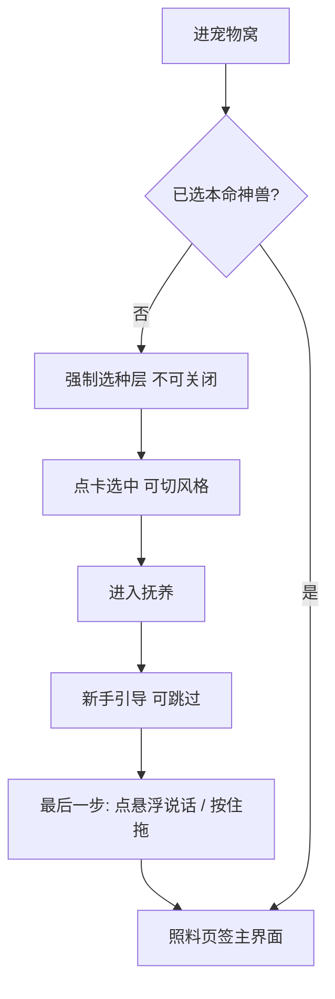
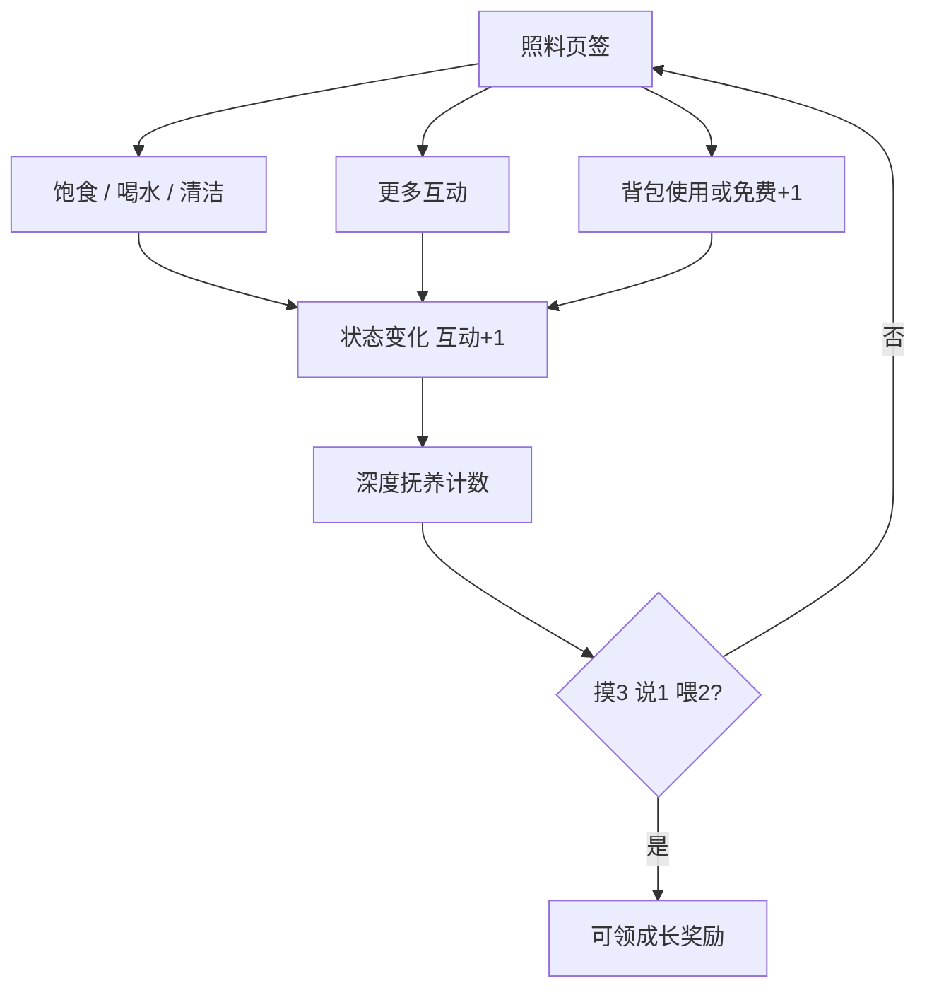
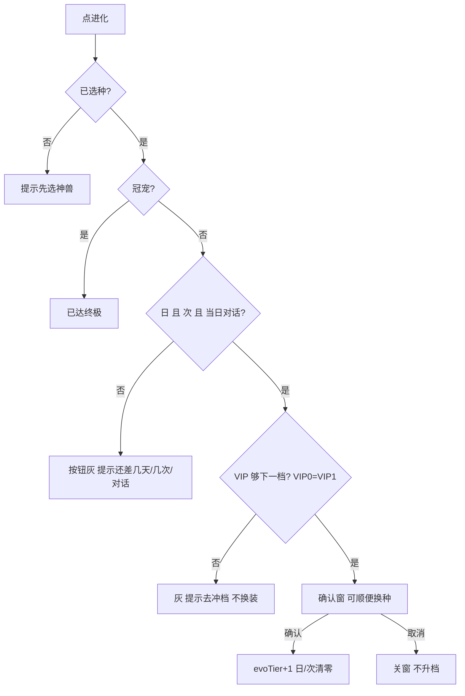
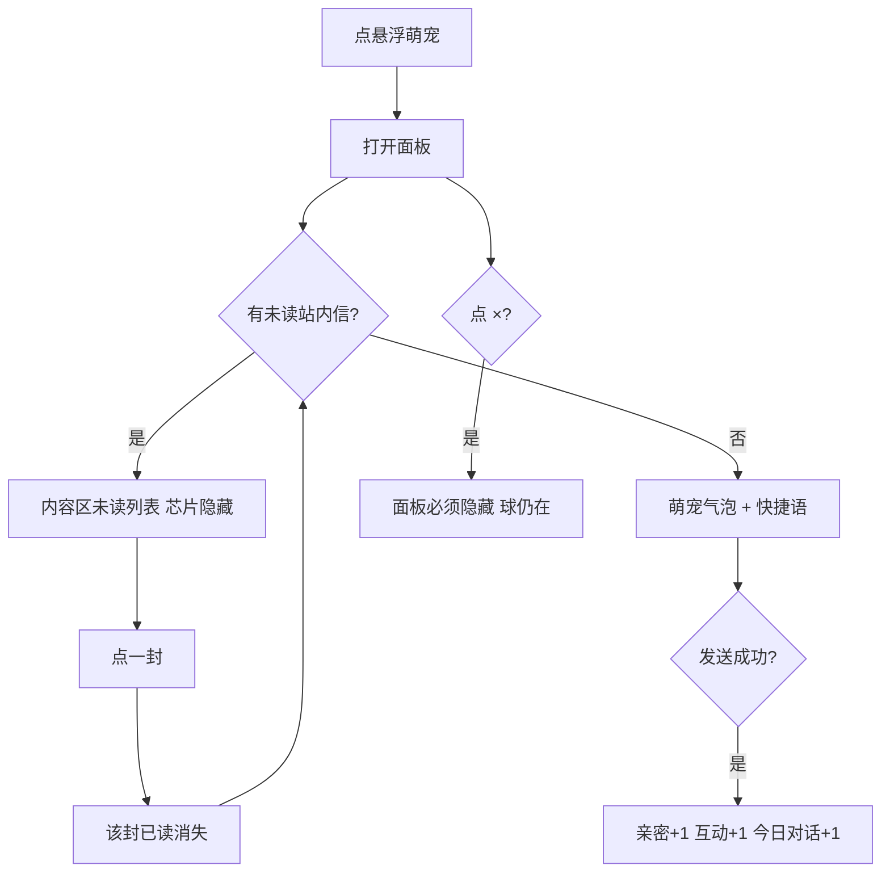
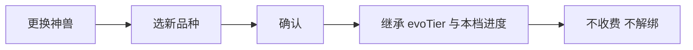
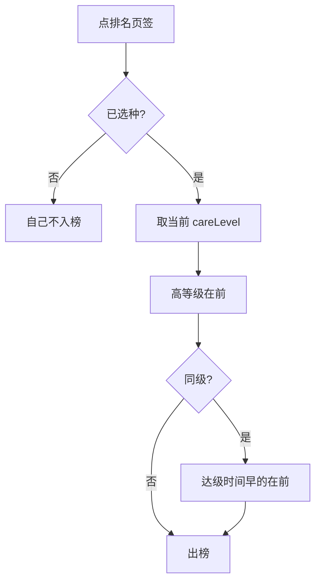

# 萌宠乐园 · 宠物窝交互说明（定稿）

> 本文件是 **宠物窝单独版本** 的交互说明：只写宠物窝定稿需求里的交互，开发 / 测试 / 宣讲按本表核对点击、跳转、反馈。  
> 完整项目 PRD（含大厅 VIP、玩家手册）仍以 [`萌宠乐园-开发测试宣讲需求.md`](./萌宠乐园-开发测试宣讲需求.md) 为准。  
> **已锁定原文不得因改结构删除。** 冲突时以 **用户最新明示 + 完整 PRD Locked + 本文件交互表** 为准。

| 项 | 内容 |
|----|------|
| **项目名称** | 萌宠乐园 |
| **范围** | 仅 **宠物窝**（PC `c-end/pet.html`、H5 `h5/pet.html`）及窝上的悬浮萌宠 / 选种 / 换种 / 进化 / 五选一 / 新手引导 |
| **端** | PC 与 H5 **业务规则同一套**；**控件位置、文案、底栏以各端原型图为准，验收时分端对照，禁止拿 PC 文案去点 H5（或反过来）** |
| **语言** | 全中文 |
| **PC 原型** | https://huasabrina8-dotcom.github.io/qq-pet-vip-prototype/c-end/pet.html |
| **H5 原型** | https://huasabrina8-dotcom.github.io/qq-pet-vip-prototype/h5/pet.html |
| **文档性质** | 宠物窝定稿交互说明书（规范六段齐全） |
| **预览** | [`宠物窝交互说明.html`](./宠物窝交互说明.html) |

**本页不写：** 游戏厅、划转、抽奖、VIP庄园、出售宠物、大厅充值主路径（只在「联通」里点到入口）。

---

## 一、需求背景与目标

### 1. 需求背景

宠物窝是萌宠乐园的养成主场。用户进窝后要能完成：选本命神兽、每日照料、深度抚养、和萌宠说话、看成长并进化、看今日排名。交互必须一眼能走完，不能靠猜。

要解决的问题：

- 入口、按钮、弹层如果对不齐，宣讲和验收会对不上原型。  
- 对话入口已从页签改到悬浮萌宠，必须单独写清，避免还去点「对话」页签。  
- 进化要同时看抚养日、互动、今日对话、VIP，灰态提示必须能说清还差什么。

### 2. 需求路径以及权限说明

#### 前台路径

| 端 | 怎么进宠物窝 | 进窝后默认页 | 窝内怎么回大厅 |
|----|----------------|--------------|----------------|
| **PC** `c-end/pet.html` | 大厅左侧宠 HUD「去照看」；侧栏宠物窝入口 | 页签默认 **照料** | 顶栏 Logo、页眉「← 返回大厅」、演示栏「← 大厅」 |
| **H5** `h5/pet.html` | 底栏 **宠物**；大厅宠 HUD「去照看 →」 | 页签默认 **照料** | 顶栏 Logo、底栏 **大厅** |

H5 底栏定稿是 **大厅｜宠物**（两档）。**没有 VIP Tab。** `h5/vip.html`、`c-end/vip.html` 当前都会跳回大厅，不要在窝里找第三底栏或独立 VIP 页。

同域共享进度：`localStorage` key `vip_butler_pet_v3`。正式环境可接服务端，不绑定必须用本地存储。

#### 后台路径

宠物窝 **不做** 独立 Admin 配置页、不做会员余额后台。发奖 / 站内信正式环境后补；原型为演示。

#### 权限配置

- 未登录：正式环境跳转登录。原型用演示身份，可直接进窝。  
- 未选本命神兽：强制选种层，**点遮罩关不掉**；不可照料、不可对话养成、不可进化、不入今日排名。  
- 已选种：照料、背包、悬浮对话、进化、换种、排名 **全部免费**，无 IAP。  
- VIP 不够下一档：可继续养，进化按钮灰，提示去冲档，**不改形态**。

#### 联通权限

| 从哪来 | 到宠物窝 | 从宠物窝出去 |
|--------|----------|--------------|
| PC 大厅 | 侧栏 / 宠 HUD「去照看」 | Logo、「← 返回大厅」 |
| H5 大厅 | 底栏「宠物」/ 宠 HUD「去照看 →」 | Logo、底栏「大厅」 |
| 悬浮萌宠（大厅或窝，两端都有） | 「去窝」 | × 关闭对话框，球还在 |
| 在线客服 | 顶栏耳机 **或** 绿色客服球 | 演示窗，不产生真工单；不计今日对话 |

独立 VIP 页当前不作为窝的入口（会跳大厅）。换种只在窝内舞台「更换神兽」。

**无** 与抽奖、厅、划转联通。抽奖不出现在宠物窝。

### 3. 需求目标

- 进窝后能按本文件走完：选种 → 照料 → 深度抚养 → 悬浮对话 → 进化 → 排名。  
- 每个可点控件都写清：**在 PC 哪、在 H5 哪**、点完怎样、灰了为什么。  
- 业务规则两端相同；**对照原型图分端点**，H5 可单手完成主路径。

### 4. 业务要求（窝内硬约束）

- 一员一宠，始终绑定；无出售、无解绑。换种 ≠ 解绑。  
- 首次进窝必选六种菲律宾神兽之一，不可跳过。  
- 页签定稿：PC 露 **照料｜今日排名**；H5 露 **照料｜排名**（点开后内容区标题仍是「今日排名」）。「对话」「帮养」页签 DOM 里有但 **display:none，不要点、不要验收露出**。  
- 和萌宠说话只走 **整页悬浮萌宠**。  
- 展示形态 = `evoTier`，升 VIP 不换装。  
- 同一次访问允许多次互动；禁止「24 小时只能点一次」。  
- 缺席可降亲密度，**不降 VIP**。  
- 只有神话神兽，没有猫狗。白橙亮厅。全中文。

---

## 二、详细功能说明

每个功能都写：名称、说明、展示规则、交互逻辑、业务规则、状态说明、延伸。

### 2.1 进窝与强制选种

| 项 | 内容 |
|----|------|
| **功能名称** | 首次进窝强制选种 |
| **功能说明** | 没选过本命神兽时，进窝先选一只菲律宾神兽，选完从幼宠养起 |
| **展示规则** | 全屏选种层盖住窝。自上而下：风格 Tab（六套立绘）→ 六只小头像名录 → 六张大卡（当前档幼宠 + 终极形态）。PC / H5 同一套层，H5 面板较窄可滚动 |
| **交互逻辑** | 点卡片选中 →「进入抚养」亮起 → 确认后关层，进主界面并弹出新手引导（可跳过）。点层外空白 **关不掉**。无关闭按钮。 |
| **业务规则** | 六选一：彩羽神鸟 / 月食神龙 / 山林精灵 / 吉兆灵鸟 / 海之仙女 / 树精守护神。未确认前不产生养成进度 |
| **状态说明** | 未选中：确认钮灰。已选中：确认可点。已选过种：不再出此层 |
| **延伸** | 之后换种走「更换神兽」，不再走强制层 |

### 2.2 新手引导

| 项 | 内容 |
|----|------|
| **功能名称** | 进窝新手引导 |
| **功能说明** | 选种后 6 步说明状态、照料、进化、悬浮对话 |
| **展示规则** | 选种完成后出现；可高亮对应区域 |
| **交互逻辑** | 1–5 步主按钮「下一步」；第 6 步主按钮改「开始照看」。旁路「跳过引导」随时可进主界面。第 6 步高亮悬浮球：点开说话、按住可拖 |
| **业务规则** | 跳过不等于没选种。重置演示后可重看 |
| **状态说明** | 进行中 / 已完成 / 已跳过 |
| **延伸** | 无 |

### 2.3 舞台、身份、下一形态

| 项 | 内容 |
|----|------|
| **功能名称** | 舞台立绘与身份 |
| **功能说明** | 看当前神兽、当前形态、亲密度；旁边预览下一形态 |
| **展示规则** | **PC**：左栏舞台，下一形态卡在立绘右侧。**H5**：顶栏下铺满，下一形态卡贴右上（hint 一行可隐藏）。身份：形态名；幼宠·亲密度；本命神兽中文名只出现一次。不要身份区再贴「今日积分·排名」横条 |
| **交互逻辑** | 立绘本身不跳转。点「下一形态」卡：未满时提示还差什么；可进化时引导去点「进化」。点「更换神兽」打开换种弹窗。点「?」展开一句说明，再点收起 |
| **业务规则** | 穿着只跟 `evoTier`。下一形态弱化预览。冠宠后改为「已达终极」，不再预览下一档 |
| **状态说明** | 未选种不展示空窝假装已领养。立绘失败用 emoji 回退 |
| **延伸** | 想吃/想玩/想喝走舞台气泡，见 2.5 |

### 2.4 更换神兽

| 项 | 内容 |
|----|------|
| **功能名称** | 随时更换神兽 |
| **功能说明** | 换成另一只神话神兽，形态档和本档抚养进度都留下 |
| **展示规则** | 舞台立绘下方「更换神兽」+「?」。PC / H5 同一位置。独立 VIP 页当前会跳大厅，**不要跑到 VIP 页验收换种** |
| **交互逻辑** | 点开弹窗 → 点一只（可看当前档+终极）→「确认更换」立刻换装；「取消」关窗、不换。不收费 |
| **业务规则** | 新神兽继承当前 `evoTier` 与本档日/次。不解绑。一人始终一只 |
| **状态说明** | 未选种不出现换种。确认中防重复点 |
| **延伸** | 进化弹窗里也可顺便换种，规则相同 |

### 2.5 当日抚养、状态、主动需求

| 项 | 内容 |
|----|------|
| **功能名称** | 当日抚养与状态 |
| **功能说明** | 点饱食 / 喝水 / 清洁改四条状态；满足想吃 / 想玩 / 想喝 |
| **展示规则** | 「当日抚养」三颗大按钮。四条状态：饱食 / 心情 / 清洁 / 健康，0–100。进页随时间缓慢下降。对应需求未满足时按钮可带红点，舞台出气泡 |
| **交互逻辑** | 点一下即成功（未选种除外）。同一次访问可连点多次。满足对应需求后该项安静约 24h，到期再提醒 |
| **业务规则** | 全部免费。每次成功：本档互动 +1、亲密度、今日积分、合格抚养日按 24h 窗口计。想吃←喂食/零食；想玩←玩耍/散步；想喝←喝水。与亲密度保护窗独立 |
| **状态说明** | 可点 / 未选种禁用。需求：未满足 / 已满足（安静中） |
| **延伸** | 两端「当日抚养」都有饱食 / 喝水 / 清洁。**PC** 右侧「更多互动」仍保留喂食 / 喝水 / 清洁（与左侧大钮同一套规则，可再点）。**H5** 用样式藏掉这三颗，更多互动只留玩耍、抚摸、陪伴散步、讲故事、喂零食、合影 |

### 2.6 更多互动与深度抚养

| 项 | 内容 |
|----|------|
| **功能名称** | 更多互动 + 今日深度抚养 |
| **功能说明** | 玩耍、抚摸、散步、讲故事、喂零食、合影等；完成摸×3 + 说×1 + 喂×2 可领成长奖励 |
| **展示规则** | 页签「照料」内。**PC** 更多互动 9 钮；**H5** 可见 6 钮（喂/喝/清洁已在当日抚养）。深度抚养：PC 节奏卡写「今日深度抚养」；H5 写「今日抚养」 |
| **交互逻辑** | 点对应按钮即一次成功。对话 ×1 必须 **悬浮萌宠发送成功**。三项都满后出现领取；点领取给亲密度礼包 + 少量 VIP XP（演示）。未满不可领 |
| **业务规则** | 全部免费。计入本档互动与亲密度。抚摸每次 +1 亲密，散步/合影 +2。深度抚养与进化「今日对话」门槛独立：幼宠档聊 2 次，深度抚养的 ×1 也算完成 |
| **状态说明** | 0/3、进行中、可领取、已领取（当日） |
| **延伸** | 页签无「对话」 |

### 2.7 形态成长 / 养成进度与进化

| 项 | 内容 |
|----|------|
| **功能名称** | 养成进度与进化 |
| **功能说明** | 本档养够日、次、当天对话，且 VIP 够，点进化升一档 |
| **展示规则** | PC 标题「形态成长」；H5 标题「养成进度」。三条：抚养日 have/need、互动 have/need、今日对话 have/need。旁「进化」按钮。下方一句提示还差什么 |
| **交互逻辑** | 未达标：按钮灰；点了 Toast 提示还差几天 / 几次 / 再对话几次，或先升 VIP。达标：按钮亮；点开确认弹窗，可顺便换种或只升形态；确认后形态 +1，本档日/次清零，预览刷新。取消关窗不升档 |
| **业务规则** | 必须同时：合格抚养日、本档互动、**当天对话**、VIP≥目标档（VIP0=VIP1 可进银徽）。日/次进化后清零；当日对话按自然日不清。数字见下表，与 `STAGE_GROWTH` 一致 |
| **状态说明** | 需抚养 / 需对话 / 需 VIP / 可进化 / 已达终极（冠宠按钮不可用） |
| **延伸** | 达冠宠可弹五选一，见 2.13 |

**进化门槛（Locked）**

| VIP | 当前 | 下一档 | 合格抚养日 | 互动 | 每天对话 |
|-----|------|--------|------------|------|----------|
| VIP0 / VIP1 | 幼宠 | 银徽 | 2 | 6 | 2 |
| VIP2 | 银徽 | 管家 | 4 | 12 | 2 |
| VIP3 | 管家 | 金甲 | 6 | 20 | 3 |
| VIP4 | 金甲 | 翼宠 | 10 | 36 | 3 |
| VIP5 | 翼宠 | 冠宠 | 14 | 56 | 4 |
| VIP5 | 冠宠 | — | — | — | 不再进化 |

计数：合格日 = 滚动 24h 内有互动最多 +1 日，不是自然日自动 +1。互动 = 下表动作每成功 1 次 +1。今日对话 = 自然日清零，悬浮发送成功才 +1。

计入互动 +1：饱食、喝水、清洁、玩耍、抚摸、散步、讲故事、喂零食、合影、对话（悬浮发送成功）。背包对应照料同样 +1。自动问候、站内信、客服、发送失败不算对话。

### 2.8 抚养节奏与亲密度保护

| 项 | 内容 |
|----|------|
| **功能名称** | 24h 抚养节奏 |
| **功能说明** | 提示下次回来、亲密度保护剩余、今日深度抚养 0/3 |
| **展示规则** | PC 单独「抚养节奏」卡。H5 合进「养成进度」卡底部三格。文案不要写成 VIP 保护 |
| **交互逻辑** | 卡面只读，倒计时自动走。该回来时大厅 HUD 提示「去照看」 |
| **业务规则** | 约 24h 一轮深度抚养。超时未互动：亲密度可能 −1 / 每满 24h，下限 Lv.1，**不降 VIP** |
| **状态说明** | fresh / due_soon（不到 3h）/ due / overdue |
| **延伸** | 与需求 24h 安静窗独立 |

### 2.9 形态图鉴

| 项 | 内容 |
|----|------|
| **功能名称** | 形态图鉴 |
| **功能说明** | 点档看当前饲养或过去档回顾，未养成档只看说明 |
| **展示规则** | 照料区上方横滑六档：幼宠→银徽→管家→金甲→翼宠→冠宠 |
| **交互逻辑** | 点 **当前档**：回到照料。点 **已养成过去档**：下方换成回顾（门槛、穿着、累计日/次），可「回到当前形态继续抚养」。点 **未养成档**：只看解锁说明，**不能假穿** |
| **业务规则** | 未养成不能假装已穿上 |
| **状态说明** | 当前 / 已养成 / 未养成（含需 VIP） |
| **延伸** | 演示「养成到金甲」便于点前面的档 |

### 2.10 页签：照料｜今日排名

| 项 | 内容 |
|----|------|
| **功能名称** | 窝内页签 |
| **功能说明** | 在照料与排名之间切换 |
| **展示规则** | **PC 页签文案：照料｜今日排名。H5 页签文案：照料｜排名。** 不要把「今日排名」四个字拿到 H5 页签上找。没有「对话」，没有「帮养」 |
| **交互逻辑** | 点「照料」显示更多互动、深度抚养、背包。点排名页签刷新榜。默认照料 |
| **业务规则** | 「对话」页签暂时不加。帮养规则在状态层，主界面不露出 |
| **状态说明** | 照料选中 / 排名选中 |
| **延伸** | 说话走悬浮，见 2.11 |

### 2.11 悬浮萌宠对话与未读站内信

| 项 | 内容 |
|----|------|
| **功能名称** | 整页悬浮对话框 |
| **功能说明** | 和萌宠说话；有未读站内信时内容区先展示未读信 |
| **展示规则** | 大厅和宠物窝都有悬浮球（同一套 `pet-float.js`）。**PC**：球在整页游走；对话框是右下约 360×480 卡片。**H5**：球限制在中间列、避开顶栏和底栏；对话框贴在底栏上方通栏小卡片（约半屏高），不是全屏。标题「和××对话」。有未读时球上红点，角标可写「信」 |
| **交互逻辑** | **点球**：打开面板。**按住拖**：挪位置（引导最后一步要教）。**×**：必须真正隐藏面板，球还在。**去窝**：进宠物窝。**快捷语**：填入并发送。**输入发送**：成功才计。**点一封未读信**：该封已读，从列表消失，列表刷新；全部已读后恢复气泡和快捷语。打开面板 **不会** 把全部信标已读 |
| **业务规则** | 发送成功 1 条：+1 亲密度、+1 本档互动、+1 今日对话、计入深度抚养对话。不算：自动问候、站内信、客服、失败/空/超 80 字。未选种提示先选神兽。站内信不进照料/排名页签 |
| **状态说明** | 面板关 / 开且有未读 / 开且无未读 |
| **延伸** | 窝内隐藏的对话页签规则仍在，当前不露出 |

### 2.12 今日排名

| 项 | 内容 |
|----|------|
| **功能名称** | 今日排名 |
| **功能说明** | 按当日宠物亲密度等级排，含假玩家 |
| **展示规则** | 三列：排名 / 用户名 / 宠物名称。**PC** 我的条：我的排名 / 今日 x 分 / 累计；副文案仍提今日积分（仅展示，不排序）。**H5** 我的条：排名 / 今日 / 累计（无「分」字、无那段副文案） |
| **交互逻辑** | 打开页签即按规则刷新。列表行不可点进别人窝（本版本） |
| **业务规则** | ① `careLevel` 高→低；② 同级按达到该等级的时间早→晚；仍相同按会员账户升序。自然日重排。未选种不入榜；已选种即使当天没照料也入榜。不按 VIP、不按 evoTier、不按今日积分 |
| **状态说明** | 已选种有列表；未选种自己无名次 |
| **延伸** | 帮养加的是今日积分，不加排名权重 |

### 2.13 小背包

| 项 | 内容 |
|----|------|
| **功能名称** | 每日免费背包 |
| **功能说明** | 仙果 / 灵嬉球 / 净灵露加强喂食、玩耍、清洁 |
| **展示规则** | 照料页签内。无购买按钮。H5 标题「小背包 · 免费补给」 |
| **交互逻辑** | **使用**：扣 1 个库存，做一次加强照料。对应本日照料次数已满则按钮改「本日已达标」且不可点（达标本身 **无额外奖励**，只是关掉当天再用背包刷）。**免费+1**：库存 +1，达标后仍可领，当天往往用不出去，跨日再解。库存为 0 时使用不可点 |
| **业务规则** | 每日免费保底仙果×3、灵嬉球×2、净灵露×2。达标阈值：喂食 2 次锁仙果；玩耍 1 次锁灵嬉球；清洁 1 次锁净灵露（大按钮照料也计入次数）。使用比普通照料状态涨更多，亲密多 +1，VIP XP 按 +12 |
| **状态说明** | 可使用 / 本日已达标 / 无库存 |
| **延伸** | 无 IAP |

### 2.14 在线客服

| 项 | 内容 |
|----|------|
| **功能名称** | 在线客服演示 |
| **功能说明** | 顶栏耳机打开客服对话 |
| **展示规则** | **PC 顶栏**：耳机在头像右侧。**H5 顶栏**：耳机在余额右侧、刷新左侧。两端另有 **绿色客服球**（右下，打开后耳机钮可关窗）。开客服会先关掉萌宠对话框 |
| **交互逻辑** | 点开演示窗，快捷语有回复；关闭即关。不进悬浮萌宠、不计入今日对话 |
| **业务规则** | 演示，不产生真实工单 / 真钱 |
| **状态说明** | 关 / 开 |
| **延伸** | 正式客服后补 |

### 2.15 冠宠五选一

| 项 | 内容 |
|----|------|
| **功能名称** | 终极形态礼物 |
| **功能说明** | 养到冠宠后每品种一次自选礼物 |
| **展示规则** | 达冠宠或演示「VIP5 终极奖励」时弹。文案必须含「非充值」 |
| **交互逻辑** | 五选一 → 确认领取入账/加亲密/加积分；稍后可关。同一品种已领过不再弹 |
| **业务规则** | 现金 ₱88 / ₱188 / 亲密度大礼包 / 今日积分加成 / 24h 双倍亲密度。换种养到冠宠可再选一次。确认中防重复 |
| **状态说明** | 未达终极不出现；可领；已领 |
| **延伸** | 正式发奖服务端后补 |

### 2.16 演示工具（仅原型）

| 项 | 内容 |
|----|------|
| **功能名称** | 宠物窝演示折叠栏 |
| **功能说明** | 宣讲捷径，不挡主路径 |
| **展示规则** | 折叠「演示工具」，默认收起。**PC** 在右栏最底部，内含「← 大厅」。**H5** 在照料页签、背包下面，**没有**大厅链（用底栏回大厅） |
| **交互逻辑** | 本档抚养完成：填满日/次/今日对话，进化可点。养成到金甲：便于点图鉴回顾。经过24小时：拨保护窗。需求提醒：需求到期。VIP5 终极奖励：打开五选一。未读站内信：悬浮未读加回来。重置演示：清空进度，下次进窝重新选种 |
| **业务规则** | 标明演示，不可当正式对账 |
| **状态说明** | 收起 / 展开 |
| **延伸** | 正式环境不出现 |

---

## 三、流程图 / 交互说明

文字规则已在第二节。本节按 **当前定稿原型图** 列交互：PC 对 `c-end/pet.html`，H5 对 `h5/pet.html`。业务结果两端相同，**点哪里、叫什么、有没有这个钮，必须分端看，禁止串端验收。**

### 3.0 怎么读表

- **端 = 两端**：两个原型都有这个交互，但位置/文案以「PC 原型图」「H5 原型图」两列为准。  
- **端 = 仅 PC**：H5 原型图上没有，不要在手机页找。  
- **端 = 仅 H5**：PC 原型图上没有，不要在桌面页找。  
- 「原型无」不是功能没做，是 **这一端画面上不露这个控件**。  
- 窝内 **没有充值按钮**（充值只在大厅顶栏）。独立 VIP 页会跳大厅，窝内不测 VIP Tab。

### 3.0.1 PC 分区（左栏 + 右栏，无底栏）

从上到下、从左到右：

1. **顶栏**：Logo Juan365 · 搜索（无跳转）· P/G 余额（只读）· 刷新 · 头像（无跳转）· 客服耳机。**无充值。**  
2. **页眉**：← 返回大厅 · 宠物窝（当前页，不是链）  
3. **左栏**：舞台立绘 → 更换神兽 + ? → 下一形态卡（立绘右侧）→ 身份 → **当日抚养** 饱食/喝水/清洁 + 四条状态 → **形态成长** 三条 + 进化 → **抚养节奏** 三行  
4. **右栏**：形态图鉴横滑 → 页签 **照料｜今日排名** → 照料时：更多互动 9 钮 + 深度抚养 + **小背包**；排名时：我的条 + 三列表  
5. **右栏底**：折叠「演示工具」（含 ← 大厅）  
6. **浮层**：悬浮萌宠球（整页游走）+ 右下对话卡片；绿色客服球  
7. **按需弹层**：选种、引导、换种、进化、五选一、发放庆祝、VIP 升级庆祝  

### 3.0.2 H5 分区（单列 + 底栏两档）

1. **顶栏**：Logo · P/G · **耳机 → 刷新**（顺序与 PC 相反）。无搜索、无头像、无充值。  
2. **舞台铺满**：立绘 → 更换神兽 + ?（立绘下）→ 下一形态卡贴右上  
3. **当日抚养**：饱食 / 喝水 / 清洁 + 四条状态  
4. **养成进度**（一张卡）：成长三条 + 进化 + 节奏三格（文案短：下次回来 / 保护剩余 / 今日抚养）  
5. **形态横滑** → 页签 **照料｜排名**  
6. **照料**：更多互动 **6 钮**（无喂食/喝水/清洁）+ 深度抚养 + **小背包 · 免费补给** + 演示折叠（无大厅链）  
7. **排名**：今日排名标题 + 我的条（排名 / 今日 / 累计）+ 三列表  
8. **底栏固定：大厅｜宠物**（当前高亮宠物）  
9. **浮层**：悬浮球在中间列内游走（避开顶栏、底栏）；对话框贴底栏上方通栏；绿色客服球

### 3.1 两端差异速查（先看再点）

| 对照点 | PC 原型 `c-end/pet.html` | H5 原型 `h5/pet.html` |
|--------|--------------------------|------------------------|
| 回大厅 | Logo + 「← 返回大厅」+ 演示「← 大厅」 | Logo + **底栏大厅** |
| 底栏 | 无 | **大厅｜宠物** 两档 |
| 顶栏搜索 / 头像 | 有，点了无跳转 | 无 |
| 顶栏顺序 | …刷新 → 头像 → 耳机 | …耳机 → 刷新 |
| 版式 | 左抚养、右图鉴页签 | 单列往下滚 |
| 成长区标题 | **形态成长**（单独一块） | **养成进度**（成长+节奏合一张） |
| 节奏三行 | 下次建议回来 / 亲密度保护剩余 / 今日深度抚养 | 下次回来 / 保护剩余 / 今日抚养 |
| 页签 | **照料｜今日排名** | **照料｜排名** |
| 更多互动 | 9 钮：喂食、玩耍、喝水、清洁、抚摸、陪伴散步、讲故事、喂零食、合影 | **只露 6 钮**：玩耍、抚摸、陪伴散步、讲故事、喂零食、合影（喂/喝/清洁只在当日抚养） |
| 背包标题 | 小背包 | 小背包 · 免费补给 |
| 我的排名条 | 我的排名 / 今日 x **分** / 累计 | 排名 / 今日 / 累计 |
| 演示工具 | 右栏底；有 ← 大厅 | 照料页最底；无大厅链 |
| 悬浮对话框 | 右下固定尺寸卡片 | 底栏上方通栏小卡片 |
| 引导第 6 步主钮 | 「开始照看」（两端文案相同） | 同左 |

### 3.2 交互总表（按原型图逐条）

| 编号 | 控件 | 端 | PC 原型图 | H5 原型图 | 操作 | 成功之后 | 灰 / 失败 / 空 |
|------|------|----|-----------|-----------|------|----------|----------------|
| I01 | Logo Juan365 | 两端 | 顶栏最左 | 顶栏最左 | 点 | 去大厅 | — |
| I01b | ← 返回大厅 | 仅 PC | 舞台上方页眉 | **原型无** | 点 | 去大厅 | — |
| I01c | 演示 ← 大厅 | 仅 PC | 演示工具最后一粒 | **原型无**（用底栏） | 点 | 去大厅 | — |
| I02 | 刷新 | 两端 | 余额右侧 | 耳机右侧 | 点 | Toast「余额已刷新」，转圈约 0.7s | — |
| I02b | 搜索 | 仅 PC | 顶栏 Logo 旁放大镜 | **原型无** | 点 | **无跳转、无搜索页** | 不要当成功能入口 |
| I02c | 头像 | 仅 PC | 顶栏刷新与耳机之间 | **原型无** | 点 | **无跳转** | 不要当成个人中心 |
| I02d | P / G 余额 | 两端 | 顶栏只读 | 顶栏只读 | — | 展示演示余额 | 窝内不可点充值 |
| I03 | 顶栏客服耳机 | 两端 | 顶栏最右 | 余额右侧 | 点开/再点关 | 打开演示客服窗 | 不计今日对话；无真工单 |
| I03b | 绿色客服球 | 两端 | 右下角浮球 | 右下角浮球（在底栏之上） | 点开；× 关 | 同 I03；开客服会先关萌宠对话框 | 问候/客服发送都不计养成对话 |
| I03c | 客服快捷语 / 发送 / × | 两端 | 客服窗内 | 客服窗内 | 点芯片或提交，最多 120 字 | 演示回复 | 空内容不发 |
| I04 | 选种大卡 | 两端 | 选种层下方六张大卡 | 同左，可竖向滚 | 点一张 | 该卡「已选中」，确认钮亮 | 未选确认灰 |
| I04b | 选种小头像名录 | 两端 | 风格下方一排 6 只 | 同左 | 点一只 | 与 I04 同一选中态 | 与大卡同步 |
| I05 | 选种风格 | 两端 | 选种层顶部风格 Tab | 同左，三列网格 | 点一套 | 六卡/名录换该风格立绘 | — |
| I06 | 进入抚养 | 两端 | 选种层底栏 | 同左 | 点 | 关层，从幼宠开始，出引导 | 未选种不可点；点遮罩 **关不掉**；无关闭钮 |
| I07 | 引导主按钮 | 两端 | 引导层 | 同左 | 1–5 步点「下一步」；第 6 步点「开始照看」 | 前进或结束引导 | 第 2 步高亮状态条；第 3 步饱食；第 4 步喝水/清洁；第 6 步高亮悬浮球 |
| I08 | 跳过引导 | 两端 | 引导层次钮 | 同左 | 点 | 进主界面 | 仍已选种 |
| I09 | 更换神兽 | 两端 | 舞台立绘下方 | 同左 | 点 | 开换种弹窗 | 未选种隐藏 |
| I10 | 换种 ? | 两端 | 「更换神兽」右侧 | 同左 | 点开/再点关 | 一句：可随时换，继承当前档 | 点空白可收起 |
| I11 | 换种卡片 | 两端 | 换种弹窗 | 同左 | 点一只 | 选中；能看当前档+终极 | — |
| I12 | 确认更换 | 两端 | 弹窗主钮 | 同左 | 点 | 立刻换种，档位与进度不变，不收费 | 「取消」或点遮罩不换；确认中防连点 |
| I13 | 下一形态卡 | 两端 | 立绘右侧 | 舞台右上（hint 可隐藏） | 点 | 未满：提示还差日/次/对话或 VIP；可进化：去点进化；冠宠：已达终极 | 始终在；冠宠改文案 |
| I14 | 饱食 | 两端 | 左栏「当日抚养」第一颗 | 「当日抚养」第一颗 | 点 | 饱食升、互动+1；可满足想吃 24h | 未选种不可点 |
| I15 | 喝水 | 两端 | 当日抚养第二颗 | 同左 | 点 | 健康等升、互动+1；可满足想喝 24h | 未选种不可点 |
| I16 | 清洁 | 两端 | 当日抚养第三颗 | 同左 | 点 | 清洁升、互动+1 | 未选种不可点 |
| I17 | 更多互动（PC 九钮） | 仅 PC | 右栏照料：喂食、玩耍、喝水、清洁、抚摸、陪伴散步、讲故事、喂零食、合影 | **不要在 H5 找喂食/喝水/清洁这三颗** | 点一下一次 | 亲密/状态变化；本档互动+1；散步合影亲密+2 | 未选种不可点。喂/喝/清洁与 I14–I16 同一规则 |
| I17b | 更多互动（H5 六钮） | 仅 H5 | **PC 用 I17** | 照料区：玩耍、抚摸、陪伴散步、讲故事、喂零食、合影 | 点一下一次 | 同 I17 | 未选种不可点。喂/喝/清洁只点当日抚养 |
| I18 | 领取任务奖励 | 两端 | 照料区深度抚养 | 同左 | 摸3+悬浮说1+喂2 后点 | 成长奖励 + 演示 VIP XP | 未满不出现或不可领；当日已领不可再领 |
| I19 | 进化 | 两端 | 左栏「形态成长」右侧 | 「养成进度」右侧 | 点 | 四条件满：开确认窗 | 不满：灰，点了说还差几天/几次/再对话几次或升 VIP；冠宠不可进化 |
| I20 | 确认进化 | 两端 | 进化弹窗主钮 | 同左 | 点；可顺便点弹窗内品种 | evoTier+1，本档日/次清零 | 「取消」或点遮罩不升；确认中防连点 |
| I21 | 图鉴某一档 | 两端 | 右栏上方横滑六档 | 养成进度下方横滑 | 点 | 当前档=照料；已养成=回顾；未养成=说明 | 不能假穿 |
| I21b | 回到当前形态继续抚养 | 两端 | 回顾页主钮 | 同左 | 点 | 回到照料当前档 | 未养成档没有这钮 |
| I21c | 自选奖励 | 两端 | 冠宠横幅「自选奖励」 | 同左 | 点 | 打开五选一 | 该品种已领则不再出 |
| I22 | 页签照料 | 两端 | 文案 **照料** | 文案 **照料** | 点 | 更多互动+背包 | 默认选中 |
| I23 | 页签排名 | 两端 | 文案 **今日排名** | 文案 **排名**（内容标题仍是今日排名） | 点 | 按 Locked 刷新三列表 | 未选种自己不入榜。**列表行不可点进别人窝** |
| I24 | 背包使用 | 两端 | 小背包三行「使用」 | 小背包 · 免费补给「使用」 | 点 | 扣库存，加强对应照料 | 文案变「本日已达标」则灰（无额外奖）；库存 0 不可用 |
| I25 | 免费+1 | 两端 | 使用右侧 | 同左 | 点 | 该道具库存+1 | 达标后仍可领 |
| I26 | 悬浮萌宠球 | 两端 | 整页游走 | 中间列内游走，避开顶栏底栏 | 轻点打开；按住拖 | 开对话或未读信；拖动不算发送 | 未选种说话提示先选种。拖过再松手不打开 |
| I27 | 悬浮 × | 两端 | 右下卡片右上 | 底栏上方卡片右上 | 点 | **必须隐藏**对话框，球还在 | H5 禁止 flex 把 hidden 盖掉 |
| I28 | 去窝 | 两端 | 对话框顶栏 | 同左 | 点 | 进宠物窝 | 已在窝则留在窝 |
| I29 | 快捷语 | 两端 | 无未读时 | 同左 | 点 | 发送成功则计对话 | 有未读时芯片隐藏 |
| I30 | 发送 | 两端 | 输入框最多 80 字 | 同左 | 提交 | +亲密 +互动 +今日对话 +深度抚养对话 | 空/超长失败；问候/站内信/客服不计 |
| I31 | 未读站内信卡片 | 两端 | 悬浮内容区 | 同左 | 点一封 | 该封已读并消失 | 禁止打开面板就全标已读 |
| I32 | 五选一项 + 确认领取 | 两端 | 终极弹窗 | 同左 | 点一项再确认 | 入账或加亲密/积分；文案含非充值 | 同品种已领不再弹 |
| I32b | 稍后 | 两端 | 五选一次钮 | 同左 | 点或点遮罩 | 关窗不领 | 之后可从横幅再开 |
| I32c | 发放庆祝「太棒了」 | 两端 | 领取成功后 | 同左 | 点 | 关窗 | — |
| I33 | 升级庆祝「太棒了」 | 两端 | 窝内照料加 XP 升 VIP 时 | 同左 | 点或点遮罩 | 关窗，**形态不变** | 不是进化弹窗 |
| I34 | 底栏大厅 | 仅 H5 | **原型无底栏** | 底栏左「大厅」 | 点 | 去 `lobby.html` | — |
| I34b | 底栏宠物 | 仅 H5 | **原型无底栏** | 底栏右「宠物」，当前页高亮 | 点 | 留在 / 刷新宠物窝 | **没有 VIP 档，不要找第三粒** |
| I35 | 演示·本档抚养完成 | 两端 | 右栏底折叠内 | 照料页最底折叠内 | 点 | 日/次/今日对话填满，进化可亮 | 未选种失败；冠宠提示已终极 |
| I36 | 演示·养成到金甲 | 两端 | 同 I35 位置 | 同左 | 点 | 档到金甲，可点前面图鉴 | 未选种失败 |
| I37 | 演示·经过24小时 | 两端 | 同 I35 | 同左 | 点 | 保护窗到期，亲密可能降，VIP 不降 | — |
| I38 | 演示·需求提醒 | 两端 | 同 I35 | 同左 | 点 | 想吃/想玩/想喝再出现 | — |
| I39 | 演示·VIP5 终极奖励 | 两端 | 同 I35 | 同左 | 点 | 打开五选一 | 已领过该品种不再领 |
| I40 | 演示·未读站内信 | 两端 | 同 I35 | 同左 | 点 | 悬浮未读加回来 | — |
| I41 | 重置演示 | 两端 | 同 I35 | 同左 | 点 | 清空进度，再进窝强制选种 | PC/H5 同域一起清空 |
| I41b | 演示工具折叠 | 两端 | summary「演示工具」 | 同左 | 点展开/收起 | 露出或收起捷径钮 | 默认收起，不挡主路径 |

状态条、成长条、节奏倒计时、舞台气泡只读。排行榜行不进别人窝。

### 3.3 主路径图

#### 首次进窝

#### 当日照料

#### 进化

#### 悬浮对话与站内信

#### 换种

#### 今日排名

---

## 四、异常场景

| 异常场景 | 触发条件 | 用户感知 | 系统处理 | 是否可重试 | 备注 |
|----------|----------|----------|----------|------------|------|
| 接口失败 | 正式环境窝接口失败 | 失败态，可重新加载 | 停在当前形态，不丢档 | 是 | 原型本地状态 |
| 接口超时 | 请求超时 | 停止加载并提示 | 不写半包进度 | 是 | 正式按此 |
| 空数据 / 未选种 | 无本命神兽 | 强制选种，不是空窝装已领养 | 挡操作直到选种 | 选完即可 | — |
| 未登录 | 正式环境无会话 | 跳转登录 | 不展示别人窝 | 登录后重进 | 原型演示身份 |
| 无权限 / VIP 不够 | 日次对话已满但 VIP 不够下一档 | 进化灰，提示冲档 | 不改 evoTier | 升 VIP 后再点 | VIP0=VIP1 可进银徽 |
| 重复提交 | 连点进化确认 / 领五选一 / 已达标还用背包 | 钮灰或 Toast 本日已达标 | 不重复升档、不重复发奖、不扣第二次道具 | 否（当日背包使用） | — |
| 图片加载失败 | 立绘 404 | emoji / 占位，仍显示形态名 | 不挡照料 | 是（刷新） | — |
| 页面加载失败 | 打不开 pet.html | 支持刷新 | — | 是 | — |
| 第三方降级 | 客服/发奖失败 | 标明演示或关闭入口 | 不入真账、不开工单 | 否（演示） | — |
| 未选种点对话/进化 | 强制层未完成 | 提示先选神兽 | 不计进度 | 选完再试 | I19 / I30 |
| 进化未达标 | 日或次或当日对话不够 | 灰 + 还差几天/几次/对话 | 不升档 | 养够再点 | I19 |
| 同品种已领终极奖 | 再次达冠宠同品种 | 不再弹五选一 | 校验领奖标记 | 否 | 换种另算 |
| H5 点 × 关不掉 | 样式盖住 hidden | 挡主路径 | hidden 必须真正隐藏 | 是（修样式） | I27 |
| 24h 未互动 | 保护窗过 | 亲密可能降，大厅去照看 | 不降 VIP | 回来继续养 | I37 |
| 排名未选种 | 打开排名 | 自己不入榜 | 不编造名次 | 选种后入榜 | I23 |
| 有未读仍在闲聊 | 打开悬浮 | 必须先看未读信 | 芯片隐藏 | — | I31 |
| 打开悬浮全标已读 | 只开面板 | 禁止 | 只有点到的那封已读 | — | I31 |

活动已结束、赛事封盘：不适用（窝内无投注）。余额不足：窝内无付费；不因没钱挡照料。

---

## 五、验收标准

### 标准结构

| 验收项 | 验收标准 |
|--------|----------|
| 功能 | 第二节每条规则按文档做对 |
| 页面 | PC：左栏抚养 + 右栏图鉴页签，无底栏。H5：单列 + 底栏大厅｜宠物。页签 PC「照料｜今日排名」、H5「照料｜排名」。无购买、无对话页签、无 H5 VIP 底栏 |
| 交互 | 3.2 表按 **端** 列验收：仅 PC 的不要在 H5 找，仅 H5 的不要在 PC 找；灰态有提示 |
| 数据 | 抚养日/互动/今日对话/进化表/排名排序与 Locked 一致 |
| 异常 | 第四节每一行按表处理 |
| 兼容 | PC 与 H5 同一套规则，差异只按 3.3 |
| 性能 | 静态页可即时打开；确认钮防连点 |
| 埋点 | 本原型不要求；正式环境另列 |

### 交互验收清单（可勾选）

- [ ] PC：顶栏有搜索/头像但点了无跳转；有「← 返回大厅」；无底栏、无充值  
- [ ] H5：顶栏无搜索/头像；底栏只有 **大厅｜宠物**；没有 VIP 第三档  
- [ ] PC 更多互动 9 钮；H5 更多互动 6 钮（喂/喝/清洁只在当日抚养）  
- [ ] PC 成长区标题「形态成长」；H5「养成进度」  
- [ ] 页签 PC 写「今日排名」、H5 写「排名」  
- [ ] 第一次进窝选种关不掉；六种都能选；能看到终极形态  
- [ ] 引导可跳过；第 6 步主钮是「开始照看」；能点开悬浮并拖动  
- [ ] 饱食/喝水/清洁改状态；想吃/想玩/想喝满足后约 24h 不再催  
- [ ] 更多互动每次成功都加本档互动  
- [ ] 深度抚养摸 3 + 悬浮说 1 + 喂 2 可领；页签没有对话  
- [ ] 三条成长：抚养日、互动、今日对话；不满进化灰并提示差值  
- [ ] 幼宠→银徽：2 日 + 6 次 + 当日对话 2；VIP0/VIP1 可进银徽  
- [ ] 银徽→管家 4/12/2 VIP≥2；管家→金甲 6/20/3 VIP≥3；金甲→翼宠 10/36/3 VIP≥4；翼宠→冠宠 14/56/4 VIP≥5  
- [ ] 同一次访问可连点；合格日同一 24h 最多 +1  
- [ ] 进化确认后形态 +1，日/次清零；取消不升档  
- [ ] 升 VIP 不换装；VIP3 养满金甲仍不能进翼宠  
- [ ] 换种继承档位，不收费（入口在窝内舞台，不在 VIP 页）  
- [ ] 图鉴未养成不能假穿；已养成可回顾  
- [ ] 悬浮发送才计今日对话；问候/站内信/客服不计  
- [ ] 有未读时内容区是信；点一封才已读；× 能关  
- [ ] 排名按亲密度等级高到低、同级时间早到晚；不是积分/VIP/形态档  
- [ ] 背包无购买；达标后使用灰掉且无额外奖；免费+1 仍可点  
- [ ] 五选一文案含非充值；同品种一次  
- [ ] 重置后两边都回到选种  

---

## 六、风险预估

| 是什么 | 影响 | 出问题后怎么处理 | 有无降级 |
|--------|------|------------------|----------|
| 把 H5 底栏写成大厅｜VIP｜宠物 | 验收去点不存在的 VIP Tab | 只测大厅｜宠物 两档；冲档在大厅 | 有：大厅「冲档进度」卡片 |
| 还去做「对话」页签 | 宣讲找不到入口，今日对话计不到 | 页签只留照料/排名；说话只认悬浮 | 有：引导第 6 步教悬浮 |
| 拿 PC「返回大厅」去 H5 找 | 以为 H5 缺入口 | H5 用 Logo 或底栏大厅 | 有：底栏始终在 |
| 在 H5 更多互动点喂食 | 找不到钮，误报缺功能 | 喂/喝/清洁只点当日抚养三颗 | 有：与 PC 大钮同一规则 |
| 进化不算今日对话或把问候算进去 | 门槛错，粘性或挫败 | 只认发送成功；条上写今日对话 | 有：自然日重置 |
| 升 VIP 直接换装 | 养成过程没了 | 只读 evoTier | 有：提示冲档但不换装 |
| 背包达标被理解成领奖 | 用户问奖励在哪 | 文案是关使用，不是发奖 | 有：免费+1 仍可领库存 |
| H5 悬浮关不掉 | 主路径卡死 | × 必须 hidden 生效 | 有：关后球仍在，主界面可点 |
| 五选一当充值 | 资金/合规 | 必须写非充值；正式服务端发奖 | 有：原型不真扣款 |
| 重复点进化/领奖 | 重复升档或发奖 | 确认中置灰；品种领奖一次 | 有：状态校验 |
| 排名按积分或 VIP | 与定稿不符 | 只读 careLevel + 达级时间 | 有：积分可展示不参与比 |
| 未读信被闲聊盖住 | 漏读通知 | 有未读只展示信 | 有：无未读再回对话 |
| 立绘失败 | 选种看不清 | emoji 回退 | 有：仍显示名字 |

窝内无下单、无赔率。现金展示只在五选一，正式必须服务端入账。

---

## 相关文档

| 文档 | 用途 |
|------|------|
| **本文件** | 宠物窝定稿交互：分端分区 + 控件总表 |
| [`宠物窝交互说明.html`](./宠物窝交互说明.html) | 本说明预览 |
| [`萌宠乐园-开发测试宣讲需求.md`](./萌宠乐园-开发测试宣讲需求.md) | 完整 PRD（含大厅 / VIP / 玩家手册） |
| [`briefing.html`](./briefing.html) | 宣讲摘要 |
| [`VIP管家宠-冲档版-需求说明.md`](./VIP管家宠-冲档版-需求说明.md) | 历史规则底稿 |

冲突时以 **用户最新明示 + 完整 PRD Locked + 本文件 3.2 交互总表（分端列）** 为准。
