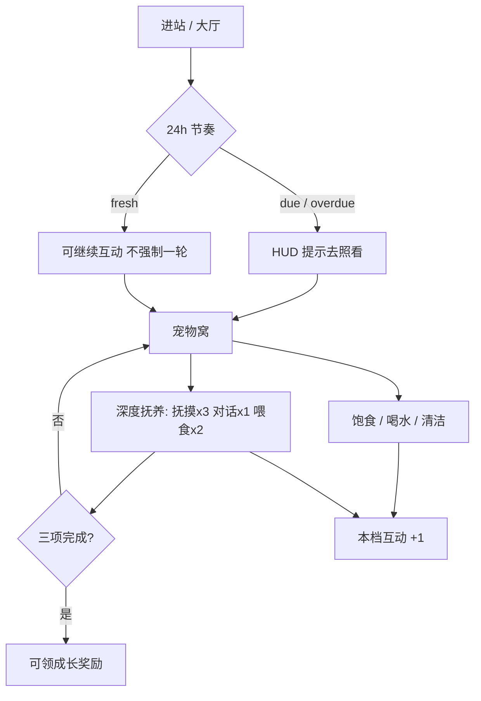
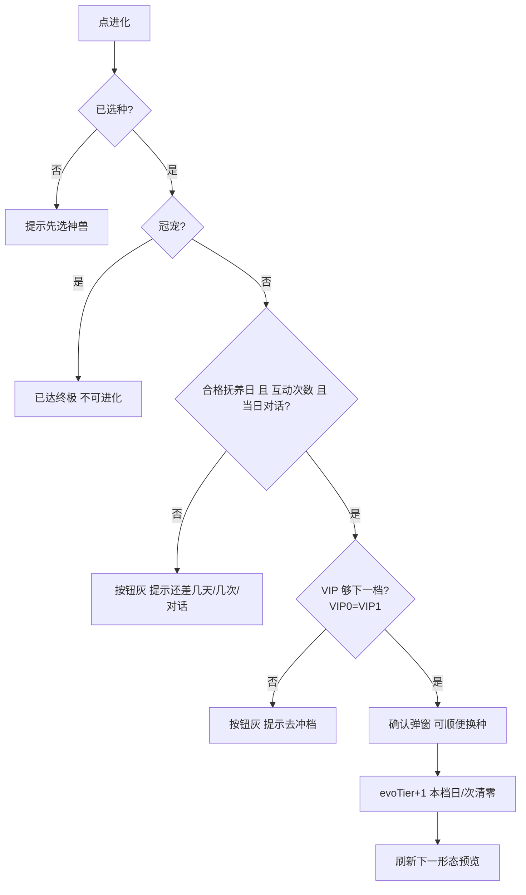
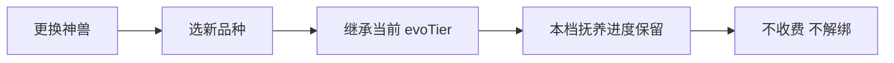
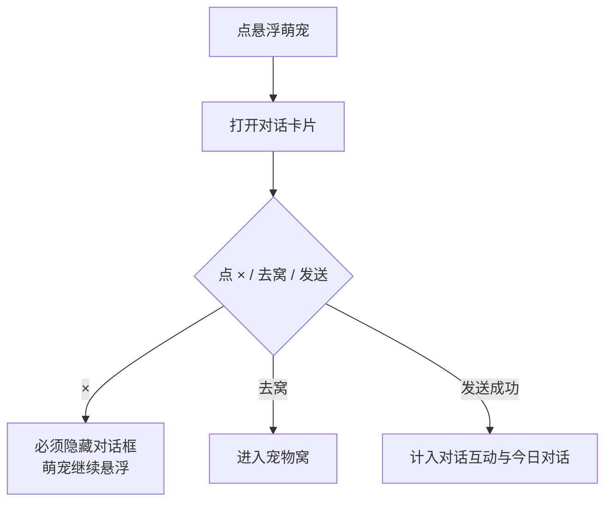
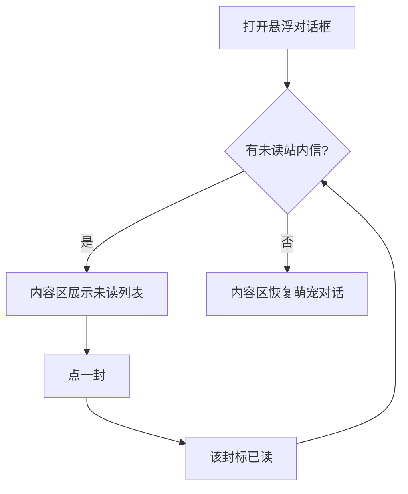
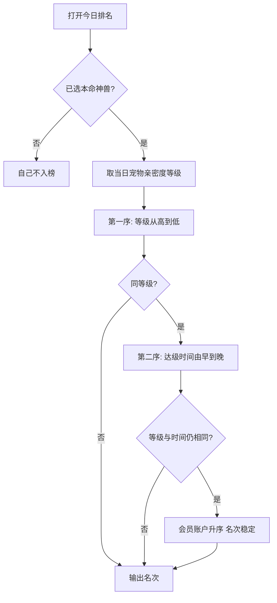

# 萌宠乐园 PRD

> 按《产品文档规范要求》完整 PRD 输出。  
> **已定稿文字全部保留**；本节只把原文归入规范结构，并补路径 / 权限、流程图、异常、验收标准结构、风险预估。  
> 冲突时以 **用户最新明示 + 本文件 Locked 条款** 为准。

| 项 | 内容 |
|----|------|
| **项目名称** | 萌宠乐园 |
| **端** | PC 和 H5 |
| **语言** | 页面与神兽口吻 **全中文**；菲语 / 英语后补 |
| **PC 原型** | https://huasabrina8-dotcom.github.io/qq-pet-vip-prototype/c-end/lobby.html?v=20260815e |
| **H5 原型** | https://huasabrina8-dotcom.github.io/qq-pet-vip-prototype/h5/lobby.html |
| **文档性质** | 给开发、测试宣讲与验收的完整 PRD（含玩家手册） |

---

## 一、需求背景与目标

### 1. 需求背景

说明为什么做这个需求、当前存在什么问题。

萌宠乐园是挂在菲盘式 VIP 冲档上的 **情感养成**：用户大约每 24 小时回来深度抚养一只菲律宾神话神兽，用照料推动形态成长，从而提高登录粘性。

| 项 | 说明 |
|----|------|
| 目的 | 提高登录粘性，让用户更频繁进站 |
| 手段 | 约每 **24 小时**回来做一轮 **深度抚养**，参与神兽成长 |
| 深度抚养 | 每日亲密度任务：**抚摸 ×3 + 对话 ×1 + 喂食 ×2**，完成后可领成长奖励 |
| 时间轴 | 滚动 24h，从上次抚养互动 `lastInteractAt` 起算 |
| 同一次访问 | **允许**多次互动；**禁止**做成「24 小时只能点一次」 |
| 缺席 | 亲密度可能降级，叙事是 **提醒回来**，不是纯惩罚；**不降 VIP** |

当前要解决的问题：

- 仅靠 VIP 冲档 / 返水，用户缺少每天必须回来的情感理由，登录粘性不够。  
- 若把形态跟 VIP 绑死「一升就换装」，养成没有过程，也无法拉动 24h 回流。  
- 宠物窝若做成付费门槛或买卖解绑，会偏离「免费照料、一人一宠」的定稿方向。

宣讲主线（定稿）：

1. **为什么做**：粘性。不是再做一个充值玩法。  
2. **用户每天回来干什么**：深度抚养一轮（摸、说、喂），神兽才会长。  
3. **长什么样**：六种菲律宾神兽，同种六档形态；靠养，不靠升 VIP 瞬间变身。  
4. **VIP 干什么**：冲档卖点页 + **成长上限**。VIP3 最多养到金甲，不会一升 VIP 就穿金甲。  
5. **换神兽**：随时可换，新神兽继承当前形态档，不解绑、不收费。  
6. **养到头**：冠宠后发 **五选一礼物**（非充值）。  
7. **双端**：PC 与 H5 同一套规则；H5 按手机重排，不是把 PC 压窄。

### 2. 需求路径以及权限说明

#### 前台路径

| 端 | 页面 | 路径 / 入口 |
|----|------|-------------|
| PC | 大厅 | `c-end/lobby.html`；侧栏或「去照看 / 宠物窝」 |
| PC | 宠物窝 | `c-end/pet.html` |
| PC | VIP | `c-end/vip.html` **当前跳转大厅**；冲档进度在大厅 |
| H5 | 大厅 | `h5/lobby.html` |
| H5 | 宠物窝 | `h5/pet.html` |
| H5 | VIP | `h5/vip.html` **当前跳转大厅**；冲档进度在大厅 |
| H5 底栏 | — | **大厅｜宠物**（两档；没有 VIP Tab） |

手机底栏两个按钮：**大厅｜宠物**。电脑从大厅侧栏或「宠物窝」入口进入。独立 VIP 页不做窝内入口。

| 入口 | 你能做什么 |
|------|------------|
| **大厅** | 看钱包、领每日返水、做每日任务、看冲档进度；点「去照看」进宠物窝 |
| **宠物窝** | 选神兽、每日照料、和萌宠对话、看成长、点进化、看今日排名 |

#### 后台路径

本需求 **不做** 独立 Admin 配置后台、不做会员余额后台。  
VIP XP / 返水 / 五选一发奖在原型里为 **演示**；正式环境服务端与发奖后补。

#### 权限配置

- 照料、背包补给、对话、进化、换种：**全部免费**，不设充值权限墙。  
- 宠物窝接口不得出现购买 / IAP。充值只存在大厅 / VIP 演示。  
- 演示开局 VIP3；未选种不可关闭选种层。  
- 在线客服为演示对话，不接真实工单 / 真钱。

#### 联通权限

- **无** 游戏厅、平台转入转出、一键回收。  
- **无** 与抽奖需求、QRPH 返利需求的功能联通；抽奖玩法不出现在本需求页面。  
- PC / H5 同域共享进度（同一 `localStorage` key `vip_butler_pet_v3`）。正式开发可按同一规则接服务端，不绑定必须用 `localStorage`。

### 3. 需求目标

说明希望达到什么效果。

- 用户大约每 24 小时回来做一轮深度抚养，参与神兽成长。  
- 形态靠抚养日 + 互动 + 当日对话进化，VIP 只作成长上限，升 VIP 不会立刻换装。  
- 提高登录粘性，让用户更频繁进站。  
- 双端同一套规则；H5 可单手完成主路径。

### 4. 业务要求

- 一员一宠，始终绑定当前 VIP；没有出售、没有解绑、没有售后再领养。换神兽 ≠ 解绑。  
- 首次进宠物窝必须选一只本命神兽，不能跳过；之后可随时换，不收费，新神兽继承当前形态档与抚养进度。  
- 同一次访问 **允许**多次互动；**禁止**做成「24 小时只能点一次」。  
- 缺席：亲密度可能降级，叙事是 **提醒回来**，不是纯惩罚；**不降 VIP**。  
- 展示形态 = `evoTier`，不跟 VIP 跳档。  
- **VIP0 与 VIP1 同一成长上限**，都可养到银徽；进管家仍要 VIP2。  
- 视觉是白橙亮厅，不是暗黑霓虹。  
- 只有六种菲律宾神话神兽，没有猫狗等现实宠物。  
- 不做 VIP庄园 / 种田。  
- 页面与神兽口吻全中文；菲语 / 英语后补。  
- 不出现「厅厅管家宠」作为产品名；对外项目名是 **萌宠乐园**。

---

## 玩家手册（定稿文案）

以下用玩家口吻写玩法。开发 / 测试按此核对入口、按钮和说明文案。

### 这是什么

萌宠乐园是你的神兽小窝。你领养一只菲律宾神话神兽，大约每 **24 小时**回来照料一轮，它才会慢慢长大。

VIP 等级决定神兽最高能养到哪一档，**升 VIP 不会立刻换装**。照料全部免费，不能买卖宠物。

### 从哪进

| 入口 | 你能做什么 |
|------|------------|
| **大厅** | 看钱包、领每日返水、做每日任务、看冲档进度；点「去照看」进宠物窝 |
| **宠物窝** | 选神兽、每日照料、和萌宠对话、看成长、点进化、看今日排名 |

手机底栏两个按钮：**大厅｜宠物**。电脑从大厅侧栏或「宠物窝」入口进入。独立 VIP 页当前跳转大厅。

### 第一次来

第一次进宠物窝，必须先选一只 **本命神兽**，不能跳过。六选一：

彩羽神鸟 · 月食神龙 · 山林精灵 · 吉兆灵鸟 · 海之仙女 · 树精守护神

选完从 **幼宠**开始养。之后会弹出新手引导（可跳过），最后一步会教你怎么用**整页悬浮的萌宠对话框**：点开说话、按住拖动。之后可以随时换一只，新神兽会继承你已经养成的形态。

### 每天怎么养

1. 进宠物窝，点 **饱食 / 喝水 / 清洁**。神兽想吃、想玩、想喝时，对应照料一次即可。  
2. 完成 **今日深度抚养**：抚摸 ×3、对话 ×1、喂食 ×2，完成后可领成长奖励。对话请点整页悬浮的萌宠（宠物窝页签暂不露出「对话」）。  
3. 同一天可以多照料几次；大约 **24 小时后再来一轮**深度抚养。  
4. 背包每天有免费补给，没有购买。本日对应照料完成后，「使用」显示「本日已达标」，不可再点。
5. 大厅 / 宠物窝顶栏耳机，或右下角绿色按钮，可打开 **在线客服**（演示对话，不产生真实工单）。

超过大约 24 小时没来，**亲密度**可能下降，大厅会提醒「去照看」。**VIP 等级不会掉。**

### 神兽怎么长大

形态一路往上：幼宠 → 银徽 → 管家 → 金甲 → 翼宠 → 冠宠。

每一档都要**同时**养够下面三样，档越高越久。进度满了、**当天对话也够**、VIP 也够时，点 **进化**，形态升一档。

| VIP等级 | 现在穿着 | 下一形态 | 本档要养够的合格抚养日 | 本档要做够的互动次数 | 每天要对话 |
|---------|----------|----------|------------------------|----------------------|------------|
| **VIP0 / VIP1** | 幼宠 | 银徽 | **2 天** | **6 次** | **2 次** |
| **VIP2** | 银徽 | 管家 | **4 天** | **12 次** | **2 次** |
| **VIP3** | 管家 | 金甲 | **6 天** | **20 次** | **3 次** |
| **VIP4** | 金甲 | 翼宠 | **10 天** | **36 次** | **3 次** |
| **VIP5** | 翼宠 | 冠宠 | **14 天** | **56 次** | **4 次** |
| — | 冠宠 | （终极，不再进化） | — | — | — |

从幼宠养到冠宠，累计至少 **36 个合格抚养日**、**130 次互动**（2+4+6+10+14 天，6+12+20+36+56 次）。每天对话按**自然日**清零，不累计到整档。

合格抚养日：**每 24 小时里有互动，最多只记 1 天**，不是日历日自动 +1。  
互动次数：饱食 / 喝水 / 清洁 / 玩耍 / 抚摸 / 散步 / 讲故事 / 喂零食 / 合影 / 对话，每成功一次 **+1**。  
每天对话：整页悬浮对话框 **发送成功 1 条** 才 +1；自动问候、站内信不算。宠物窝页签暂不露出「对话」。

舞台旁边能看到 **下一形态**。点图鉴里已养成的档，可以回顾当时怎么养上来的；还没养到的档只能看说明，不能假装已经穿上。

VIP 是天花板：

| 你的 VIP | 最高能养到 |
|----------|------------|
| VIP0 / VIP1 | 银徽 |
| VIP2 | 管家 |
| VIP3 | 金甲 |
| VIP4 | 翼宠 |
| VIP5 | 冠宠 |

养满了但 VIP 不够，进化会先提示去冲档。

### 换神兽

随时可换，不收费。换了还是原来那一档形态，进度还在。不能卖掉，也不能解绑。一人始终一只。

### 大厅每日任务

每天各做一次，可增加 VIP XP：

登录 +50 · 领返水 +40 · 访 VIP +40 · 看视频 +60

### 常见问题

| 问 | 答 |
|----|----|
| 升了 VIP，神兽怎么还没变？ | 正常。形态只跟照料和进化走，不跟 VIP 跳档。 |
| 为什么进化是灰的？ | 本档合格抚养日、互动次数或**当天对话**还没满，或 VIP 还不够下一档。数字见上面的表。 |
| 一天只能点一次吗？ | 不是。同一次来可以多照料；深度抚养大约每 24 小时一轮。 |
| 几天没来会掉 VIP 吗？ | 不会。最多亲密度下降，回来继续养即可。 |
| 宠物窝要充值才能养吗？ | 不要。照料和背包补给都免费。 |
| 今日排名怎么排？ | 看**当天你宠物的亲密度等级**，等级高的在前；等级一样，**先达到该等级的在前**。不是按 VIP，也不是按今日积分。 |
| 悬浮对话框为什么变成站内信了？ | 有未读站内信时，悬浮内容区先给你看未读信。点开一封即已读；全部看完后才回到萌宠对话。宠物窝页签暂不露出「对话」。 |

---

## 二、详细功能说明

每个功能按规范写：功能名称、功能说明、展示规则、交互逻辑、业务规则、状态说明、延伸说明。

### 2.1 六种本命神兽与选种 / 换种

| 项 | 内容 |
|----|------|
| **功能名称** | 本命神兽选种与更换 |
| **功能说明** | 首次强制选种；之后可随时换种，新神兽继承当前形态档 |
| **展示规则** | 第一次进宠物窝弹出选种层；选种 / 换种要能看到当前档和终极形态预览 |
| **交互逻辑** | 见第三节流程图「首次进窝」；换种入口在宠物窝 / VIP |
| **业务规则** | 见下 Locked 目录；换种不收费、不解绑 |
| **状态说明** | 未选种：遮罩关不掉。已选种：身份区「本命神兽」只出现一次中文名 |
| **延伸** | 六套立绘最终留哪几套后定；先六套都能切 |

| id | 中文名 | 口吻示意 |
|----|--------|----------|
| `sarimanok` | 彩羽神鸟 | 啾 |
| `bakunawa` | 月食神龙 | 嗷 |
| `diwata` | 山林精灵 | 叮 |
| `tigmamanukan` | 吉兆灵鸟 | 啼 |
| `sirena` | 海之仙女 | 哼 |
| `kapre` | 树精守护神 | 呵 |

- **首次进宠物窝必须选一种**，不可关闭、不可跳过。  
- **之后可随时更换**；新神兽升到原来的形态档，抚养进度保留。  
- 选种 / 换种要能看到 **当前档** 和 **终极形态** 预览。

绑定（Locked）：

- 一员一宠，**始终绑定当前 VIP**。  
- 没有出售、没有解绑、没有售后再领养。  
- 换神兽 ≠ 解绑。

随时可换，不收费。换了还是原来那一档形态，进度还在。不能卖掉，也不能解绑。一人始终一只。

### 2.2 同种六档成长门槛与进化（Locked）

| 项 | 内容 |
|----|------|
| **功能名称** | 形态成长与进化 |
| **功能说明** | 本档养够合格抚养日 + 互动次数 + **当天对话次数**，且 VIP 够上限，点进化升一档 |
| **展示规则** | 宠物窝养成进度 / 形态成长条（抚养日、互动、今日对话）+ 进化按钮；舞台旁下一形态预览 |
| **交互逻辑** | 未达标按钮灰色；点了提示还差几天 / 几次 / 当天还要对话几次，或先升 VIP；达标后确认，可顺便换种 |
| **业务规则** | 下列数字与原型 `STAGE_GROWTH`（含 `needChats`）一致，不得改成别的天数或次数 |
| **状态说明** | 可进化 / 需抚养 / 需 VIP / 已达终极 |
| **延伸** | 无；冠宠后不再进化 |

展示形态 = `evoTier`（0–5）。**不跟 VIP 跳档**。

必须 **同时** 满足四件事，才可点「进化」进入下一档：

1. 本档 **合格抚养日** ≥ 下表  
2. 本档 **互动次数** ≥ 下表  
3. **当天对话次数** ≥ 下表（自然日清零，不是整档累计）  
4. 当前 VIP ≥ 目标档所需 VIP（**VIP0 与 VIP1 同一档**，均可进银徽）  

点进化后：`evoTier + 1`，本档抚养日和互动次数 **清零**，开始攒下一档。当日对话次数 **不因进化清零**（仍按自然日）；下一档每天要聊的次数若更高，当天还要再聊够。

| VIP等级 | 档 `evoTier` | 当前形态 | 下一形态 | 合格抚养日 | 互动次数 | 每天对话 | 本档最短日历跨度（示意） |
|---------|--------------|----------|----------|------------|----------|----------|--------------------------|
| **VIP0 / VIP1** | 0 | 幼宠 | 银徽 | **2** | **6** | **2** | 约 2×24h |
| **VIP2** | 1 | 银徽 | 管家 | **4** | **12** | **2** | 约 4×24h |
| **VIP3** | 2 | 管家 | 金甲 | **6** | **20** | **3** | 约 6×24h |
| **VIP4** | 3 | 金甲 | 翼宠 | **10** | **36** | **3** | 约 10×24h |
| **VIP5** | 4 | 翼宠 | 冠宠 | **14** | **56** | **4** | 约 14×24h |
| VIP5 | 5 | 冠宠（终极） | — | — | — | — | 不再进化 |

从幼宠养到冠宠，累计门槛：

| VIP等级 | 养到 | 累计合格抚养日 | 累计互动次数 |
|---------|------|----------------|--------------|
| VIP0 / VIP1 | 银徽 | 2 | 6 |
| VIP2 | 管家 | 2+4 = **6** | 6+12 = **18** |
| VIP3 | 金甲 | 6+6 = **12** | 18+20 = **38** |
| VIP4 | 翼宠 | 12+10 = **22** | 38+36 = **74** |
| VIP5 | 冠宠 | 22+14 = **36** | 74+56 = **130** |

#### 怎么计数（Locked）

**合格抚养日**

- 滚动 **24 小时**窗口：本档内，距上次记日满 24h 且期间有互动，才 **+1 日**。  
- 同一 24h 窗口内无论互动多少次，**最多 +1 日**。  
- **不是**自然日 0 点自动 +1，也不是「24 小时只能点一次」。  
- 同一次访问可以多次互动；互动次数照加，抚养日仍按 24h 窗口计。

**互动次数**

下列动作每成功 1 次，本档互动 **+1**（全部免费）：

| 计入 +1 的动作 |
|----------------|
| 饱食（喂食） |
| 喝水 |
| 清洁 |
| 玩耍 |
| 抚摸 |
| 陪伴散步 |
| 讲故事 |
| 喂零食 |
| 合影 |
| 对话（页签或整页悬浮对话框，发送成功 1 条） |

背包里用仙果 / 灵嬉球 / 净灵露完成对应照料，同样 +1。  
系统自动问候、未发送成功的对话不算。演示工具「本档抚养完成」是验收捷径，直接填满本档进度（含当日对话），不按上表逐次理解。

**每日对话（今日对话）**

- 养成进度第三条：**今日对话 have / need**。数字与上表「每天对话」一致。  
- 按 **自然日** 清零（与今日积分同一天切），**不是**本档累计，也不是滚动 24h。跨日未进化：抚养日 / 互动保留，今日对话从 0 再计。  
- 整页悬浮对话框 **发送成功 1 条 +1**。同一条对话同时计入本档互动 +1。宠物窝页签暂不露出「对话」，说话入口是悬浮萌宠。  
- **不算**：系统自动问候、站内信点开、未发送成功、客服对话。  
- 与深度抚养「对话 ×1」独立：深度抚养仍是抚摸×3 + 对话×1 + 喂食×2；今日对话是进化门槛。幼宠档聊满 2 次，深度抚养的 ×1 也一并完成。  
- 超过门槛继续聊，条显示实际次数（如 31/2），满格即可。

**VIP 天花板**

- 展示形态只跟抚养进化走。  
- 抚养日、互动、**当日对话**都满了，但 VIP 不够下一档：进化按钮不可用，提示去冲档。  
- 演示开局：**VIP3**，选种后从 **幼宠**养起，上限可到 **金甲**（再往上要 VIP4 / VIP5）。  
- 例：VIP3 在金甲档养满 10 日 / 36 次 / 当日对话 3 次，仍不能进翼宠。  
- **VIP0 与 VIP1 同一成长上限**：都可养到银徽；进管家仍要 VIP2。

「进化」**不是装饰**。门槛以 **本节 Locked 表**为准：本档合格抚养日 **且** 互动次数 **且** 当天对话都满，**且** VIP ≥ 目标档（VIP0 与 VIP1 同一档）。

点下后：当前神兽形态 **+1 档**，本档抚养日与互动次数清零，下一形态预览刷新。当日对话仍按自然日保留。  

弹窗里可以顺便换种（也可取消、只升形态）。

未达标时按钮灰色；点了应提示还差几天 / 几次 / 当天还要对话几次，或提示要先升 VIP。  
冠宠后不再进化，舞台改为「已达终极」。

舞台旁始终有下一档弱化预览。达冠宠后改为「已达终极」。

### 2.3 当日抚养、状态与主动需求

| 项 | 内容 |
|----|------|
| **功能名称** | 当日抚养与主动需求 |
| **功能说明** | 喂、喝、清洁及更多互动，满足想吃 / 想玩 / 想喝 |
| **展示规则** | 宠物窝大按钮；H5 三颗在「当日抚养」，「更多互动」不再重复这三颗 |
| **交互逻辑** | 点一下即可；对应需求满足后安静 24h |
| **业务规则** | 全部免费；计入成长 / 亲密度 |
| **状态说明** | 四条状态 0–100，进页随时间缓慢下降 |
| **延伸** | 无 |

四条状态：饱食 / 心情 / 清洁 / 健康（0–100），进页会随时间缓慢下降。

主操作（大按钮，点一下即可）：

| 按钮 | 作用 |
|------|------|
| 饱食 | 喂食，可满足「想吃」 |
| 喝水 | 满足「想喝」 |
| 清洁 | 提升清洁 |

更多互动（计入成长 / 亲密度）：玩耍、抚摸、陪伴散步、讲故事、喂零食、合影等。全部免费。

H5 上喂食 / 喝水 / 清洁已在「当日抚养」，「更多互动」不再重复这三颗。

神兽会提醒 **想吃 / 想玩 / 想喝**（舞台气泡；对应按钮可带红点）。

- 对应动作满足后，该项 **安静 24 小时**。  
- 到期再提醒。  
- 与亲密度保护窗独立。

### 2.4 亲密度、24h 节奏与深度抚养

| 项 | 内容 |
|----|------|
| **功能名称** | 亲密度保护与 24h 抚养节奏 |
| **功能说明** | 约每 24h 回来一轮深度抚养；缺席降亲密度不降 VIP |
| **展示规则** | 宠物窝节奏卡；大厅宠 HUD |
| **交互逻辑** | 同一次访问可多次照料；深度抚养摸 3 + 说 1 + 喂 2 可领奖 |
| **业务规则** | 界面不要把「亲密度保护剩余」理解成 VIP 保护 |
| **状态说明** | `fresh` · `due_soon` · `due` · `overdue` |
| **延伸** | 无 |

| | 亲密度 Care Level | VIP |
|--|-------------------|-----|
| 怎么涨 | 照料、对话等 | 每日任务、领返水、充值演示、照料 XP |
| 24h 无互动 | **亲密度可能 −1**（下限 Lv.1） | **不降** |
| 进化 | 不直接当形态 | 只限制能进化到哪一档 |

界面不要把「亲密度保护剩余」理解成 VIP 保护。

宠物窝展示：

- 下次建议回来  
- 亲密度保护剩余  
- 今日深度抚养进度（0/3 项）

状态：`fresh`（还早）· `due_soon`（不到 3 小时）· `due`（该回来了）· `overdue`（已过期 / 已降级）。

大厅宠 HUD 在该回来时应提示「去照看 / 该回来抚养了」。

### 2.5 形态图鉴

照料区上方的档位条：

- 点 **当前档**：继续养  
- 点 **已养成的过去档**：看该档抚养总结（门槛、穿着、累计日/次）  
- 点 **未养成档**：看解锁说明，不能假装已经穿上  

| 项 | 内容 |
|----|------|
| **功能名称** | 形态图鉴 / 抚养总结 |
| **功能说明** | 已达成档回顾抚养成就，未养成档只看说明 |
| **展示规则** | 照料区上方档位条 |
| **交互逻辑** | 点档切换下方内容，不能假穿未养成档 |
| **业务规则** | 未养成档不能假装已经穿上 |
| **状态说明** | 当前 / 已养成 / 未养成 |
| **延伸** | 无 |

### 2.6 对话、悬浮对话框、在线客服

| 项 | 内容 |
|----|------|
| **功能名称** | 萌宠对话与在线客服 |
| **功能说明** | 对话计入深度抚养与当日进化门槛；入口为整页悬浮对话框（可说话、可拖）。窝内「对话」页签暂时不露出。有未读站内信时悬浮内容区改展示站内信；客服为演示 |
| **展示规则** | 宠物窝 Tab「照料｜今日排名」（PC / H5 同一套，暂无「对话」页签）；悬浮层铺满页面；顶栏耳机 + 右下角绿色按钮。**悬浮对话内容区（日志区）**：有未读站内信时优先展示未读站内信，无未读时才展示萌宠对话记录 |
| **交互逻辑** | 发送成功 1 条对话 +1 亲密度、+1 本档互动、+1 今日对话；H5 悬浮窗右上角 × 必须能关闭。点一封未读站内信即标为已读，列表刷新；全部已读后恢复萌宠对话 |
| **业务规则** | 客服演示不产生真实工单；自动问候不算互动次数、不算今日对话。站内信只展示 **未读**；已读不出现在该内容区。点开悬浮层不等于自动全标已读。站内信不计入深度抚养对话次数、不计入今日对话 |
| **状态说明** | 对话框打开 / 关闭；未选种时对话提示先选神兽；有未读 / 无未读 |
| **延伸** | 菲语 + 英语 + Taglish 口吻后补。正式环境站内信接平台消息服务；原型为演示数据，文案标明演示 |

当前定稿页签露出 **照料与今日排名**。「对话」页签暂时不加，说话走悬浮萌宠。

**悬浮对话 · 未读站内信（Locked）**

打开整页悬浮对话框（标题「和××对话」下方的内容区）时：

1. **有未读站内信**：内容区展示未读列表（标题、类型、时间 `YYYY-MM-DD HH:mm:ss`、正文）。快捷语芯片先收起。悬浮球显示未读红点。  
2. **无未读**：内容区恢复萌宠对话气泡与快捷语。  
3. 点一封信 → 该封标为已读，从该列表消失。  
4. 宠物窝页签暂不露出「对话」；和萌宠说话只走悬浮对话框（计入深度抚养与今日对话）。站内信 **不**改到照料 / 排名页签。  
5. 演示工具「未读站内信」可把未读加回来，便于宣讲。

大厅 / 宠物窝顶栏耳机，或右下角绿色按钮，可打开 **在线客服**（演示对话，不产生真实工单）。

新手引导（可跳过）最后一步会教你怎么用**整页悬浮的萌宠对话框**：点开说话、按住拖动。

H5 悬浮对话框为底栏上方小卡片（非全屏底栏），右上角 × 关闭后必须真正隐藏。

### 2.7 今日排名

照料 / 帮养 / 对话可加 **今日积分**（自然日清零，累计分保留）。今日积分仍可展示，也可被五选一「今日积分加成」影响，但 **不作为排名依据**。

排行榜三列：**排名 / 用户名 / 宠物名称**（含假玩家）。  
定稿界面身份区 **不再**重复贴「今日积分 · 排名」横条。

**排名规则（Locked）**

宠物窝「今日排名」按两级排序，PC 与 H5 同一套：

1. **第一序：当日宠物等级，从高到低。**  
   当日宠物等级 = 查询时刻该用户宠物的 **亲密度等级（careLevel）**。  
   取自然日内实时等级；亲密度因 24h 未互动下降时，排名随当前等级更新。  
   **不按** VIP 等级，**不按** 形态档 `evoTier`，**不按** 今日积分。

2. **第二序：时间先后，由早到晚。**  
   等级相同，按该用户 **达到当前用于排名的亲密度等级** 的时间升序，时间早的排前面。  
   等级与时间仍相同：按会员账户升序，保证名次稳定；演示假玩家按种子 id。

3. **日切：** 榜单按自然日。跨日后按新一日的当日等级与达成时间重新排。累计积分保留，但不参与排序。

4. **入榜：** 未完成本命神兽选种，不进入当日排名。已选种即入榜（即使当日尚未照料）。演示假玩家须带宠物等级与达成时间，与真用户同一套排序。

| 项 | 内容 |
|----|------|
| **功能名称** | 今日排名 |
| **功能说明** | 按当日宠物等级从高到低、同级按达级时间由早到晚的轻排行，含假玩家 |
| **展示规则** | 宠物窝「今日排名」页签；三列：排名 / 用户名 / 宠物名称；身份区不再重复横条 |
| **交互逻辑** | 打开页签即按 Locked 规则刷新列表与「我的排名」；亲密度升降后再次打开应重排 |
| **业务规则** | 见上 Locked：`careLevel` 降序 + 达级时间升序；今日积分不参与比较 |
| **状态说明** | 已选种有数据即展示列表；未选种不入榜 |
| **延伸** | 好友帮养规则在状态层仍在（积分含帮养）；主界面暂不作为入口。帮养若后续打开页签，按宠物窝规则测。帮养加的是今日积分，不加排名权重 |

### 2.8 背包

每日免费：仙果 ×3、灵嬉球 ×2、净灵露 ×2。可再点「免费 +1」。  
**没有购买按钮。**  
本日对应照料任务达成后（喂食 / 玩耍 / 清洁），背包「使用」不可点，文案为 **本日已达标**。

| 项 | 内容 |
|----|------|
| **功能名称** | 每日免费背包 |
| **功能说明** | 免费补给，对应照料达标后不可再用 |
| **展示规则** | 宠物窝背包区；无购买按钮 |
| **交互逻辑** | 使用对应照料；已达标置灰 |
| **业务规则** | 无 IAP |
| **状态说明** | 可使用 / 本日已达标 |
| **延伸** | 无 |

### 2.9 VIP 冲档与每日任务

| 项 | 内容 |
|----|------|
| **功能名称** | VIP 冲档与每日任务 |
| **功能说明** | 用任务 / 返水 / 演示充值加 XP；VIP 只作宠物成长上限 |
| **展示规则** | 大厅任务与返水；VIP 页等级与立绘风格 |
| **交互逻辑** | 每日各做一次；权益领取走「联系客服领取」弹窗演示 |
| **业务规则** | 充值演示不改变宠物形态；升 VIP 不会立刻换装 |
| **状态说明** | 开局 VIP3，进度指向 VIP4 |
| **延伸** | 无 |

| Level | Tier | 累计 XP | 返水 | 上限 |
|-------|------|---------|------|------|
| VIP0 | VIP0s | 0 | 0% | ₱0 |
| VIP1 | VIP1s | 200 | 1% | ₱888 |
| VIP2 | VIP2s | 1,000 | 2% | ₱1,888 |
| VIP3 | VIP3s | 5,000 | 3% | ₱3,888 |
| VIP4 | VIP4s | 15,000 | 4% | ₱6,888 |
| VIP5 | VIP5s | 50,000 | 5% | ₱9,999 |

| 任务 | XP | 如何完成 |
|------|-----|----------|
| 每日登录签到 | +50 | 点去完成 |
| 领取每日返水 | +40 | 当日首次成功领取时自动完成 |
| 访问 VIP 页 | +40 | 进 VIP 页 |
| 观看推广视频 | +60 | 点任务或大厅「观看赚钱」 |

| 动作 | XP |
|------|-----|
| 领取每日返水本身 | +30 |
| 充值演示 | +25，同时 P +₱100 |
| VIP 页 Demo +XP | +500 |
| 喂食 / 玩耍 / 清洁 | +8 |
| 喝水 | +6 |
| 用背包道具照料 | +12 |

权益领取走「联系客服领取」弹窗演示，不接真客服工单。

VIP 页可随时切换立绘风格（对应展示档，不付费）；最终留哪几套后定。

### 2.10 终极形态奖励

| 项 | 内容 |
|----|------|
| **功能名称** | 冠宠五选一礼物 |
| **功能说明** | 养到冠宠后每品种一次自选礼物，非充值 |
| **展示规则** | 达冠宠或演示 VIP5 终极奖励时弹出 |
| **交互逻辑** | 五选一，选后入账 / 加亲密度 / 加积分 |
| **业务规则** | 文案含「非充值」；同一品种不能领第二次；换种养到冠宠可再选 |
| **状态说明** | 未达终极不出现；已领过该品种不再弹 |
| **延伸** | 正式发奖接服务端后补 |

五选一（非充值）：现金 ₱88 / 现金 ₱188 / 亲密度大礼包 / 今日积分加成 / 24h 双倍亲密度。

### 2.11 定稿界面

#### 宠物窝 PC

左：舞台（神兽居中，下一形态在旁）→ 身份（形态名 / 幼宠·亲密度·照料次数 / 本命神兽）→ 当日抚养 → 形态成长 + 进化 → 抚养节奏。  
右：形态图鉴 → Tab「照料｜今日排名」→ 更多互动。对话走整页悬浮萌宠，页签暂不露出「对话」。  
演示工具收在折叠栏，不挡主路径。

**不要出现**：已绑定橙章、舞台装饰云、身份区重复的「今日积分·排名」条、品种名写三遍。

#### 宠物窝 H5

舞台铺满顶栏下；下一形态小卡贴右上；当日抚养三颗大按钮；养成进度把成长条和三格节奏合在一张卡；形态横滑；照料 / 排名分段开关（暂无对话页签）。  
底栏：**大厅｜宠物**（两档，没有 VIP）。触摸目标建议 ≥44px。  
顶栏耳机与右下角绿色按钮打开在线客服演示窗。换种只在窝内舞台。宠物窝交互分端总表见 [`萌宠乐园-宠物窝交互说明.md`](./萌宠乐园-宠物窝交互说明.md)。

#### 已实现但当前主界面未露出

好友帮养：规则在状态层仍在（积分含帮养）。  
窝内「对话」页签：规则仍在，**当前主界面不露出**；说话入口是悬浮萌宠。  
**当前定稿页签露出照料与今日排名。** 帮养若后续打开页签，按宠物窝规则测。

### 2.12 开发落地要点

| 项 | 说明 |
|----|------|
| 双端同一套规则 | 共享 `c-end/js/state.js`，key `vip_butler_pet_v3` |
| 展示形态 | 只读 `evoTier`，禁止 `VIP 一升就换装` |
| 换种 | 继承当前形态档 + 本档抚养进度；不重置绑定 |
| 进化门槛 | 见 **2.2**：抚养日 **且** 互动次数 **且** 当天对话 **且** VIP ≥ 目标档（VIP0=VIP1）；数字 Locked |
| 合格抚养日 | 滚动 24h 窗口内有互动才 +1 日，不是自然日自动 +1 |
| 互动次数 | 照料 / 对话每成功 1 次 +1；见 2.2 动作表 |
| 每日对话 | 自然日清零；悬浮对话框发送成功才 +1（窝内对话页签暂不露出）；自动问候 / 站内信不算；进化当天仍要达到当前档 `needChats` |
| 付费隔离 | 宠物窝接口不得出现购买 / IAP；充值只存在大厅 / VIP 演示 |
| 今日排名 | 第一序当日宠物亲密度等级从高到低；同级按达级时间由早到晚；不按 VIP / 形态档 / 今日积分 |
| 悬浮站内信 | 有未读时悬浮内容区展示未读站内信；点一封才标已读；无未读恢复萌宠对话 |
| 文案 | C 端全中文；数据可保留英文内部名 / `labelEn` |
| 重置 | 页内「重置演示」清空 `vip_butler_pet_v3`，应能重新选种 |

原型是静态 HTML/CSS/JS，无构建。正式开发可按同一规则接服务端；本文件是产品规则，不绑定必须用 `localStorage`。

---

## 三、流程图 / 交互说明

交互逻辑：用户操作流程（图）。  
**宠物窝定稿交互单独成册**（分端分区 + 控件总表）：[`萌宠乐园-宠物窝交互说明.md`](./萌宠乐园-宠物窝交互说明.md) · 预览 [`宠物窝交互说明.html`](./宠物窝交互说明.html)。本节保留全站主路径图。窝内交互以该册 **PC / H5 分列** 为准，不要把两端控件混成一条。

### 3.1 首次进窝

```mermaid
flowchart TD
  A[进宠物窝] --> B{已选本命神兽?}
  B -->|否| C[强制选种层<br/>不可关闭/不可跳过]
  C --> D[六选一看当前档+终极形态]
  D --> E[确认选种 从幼宠开始]
  E --> F[新手引导可跳过]
  F --> G[最后一步: 整页悬浮对话框<br/>点开说话 / 按住拖动]
  B -->|是| H[进入抚养主界面]
  G --> H
```

### 3.2 每日深度抚养

### 3.3 进化

### 3.4 换神兽

### 3.5 悬浮对话（H5 / PC）

### 3.5b 悬浮对话 · 未读站内信

### 3.6 今日排名

---

## 四、异常场景

常见异常场景模板（按规范；本需求无真投注，对应项标为不适用或演示降级）。

| 异常场景 | 处理方式 |
|----------|----------|
| 接口请求失败 | 页面展示失败状态，可重新加载。原型为本地状态，正式接服务端后按此 |
| 接口超时 | 停止加载并提示。正式环境按此 |
| 数据为空 | 展示默认空状态。未选种走强制选种，不展示空窝假装已领养 |
| 用户未登录 | 正式环境跳转登录页。原型无真登录，用演示身份 |
| 权限不足 | 禁止操作。例：VIP 不够下一档不可进化；未选种不可对话养成 |
| 重复点击提交 | 按钮置灰防重复提交。进化确认中、领奖确认中、背包本日已达标不可再点 |
| 活动已结束 | 不适用本需求主路径 |
| 赛事已封盘 | 不适用（本需求无投注） |
| 余额不足 | 宠物窝无付费门槛。大厅权益领取走客服领取说明，不是真支付 |
| 系统维护中 | 正式环境页面禁止访问。原型不接维护页 |
| 图片加载失败 | 显示默认占位 / emoji 回退 |
| 页面加载失败 | 支持刷新重试 |
| 第三方接口异常 | 展示降级数据或关闭入口。客服 / 发奖为演示，失败不产生真工单真钱 |
| 未选神兽点对话 / 进化 | 提示先去选本命神兽 |
| 进化未达标 | 按钮灰色；提示还差几天 / 几次 / 当天还要对话几次，或提示要先升 VIP |
| 同一品种已领终极奖励 | 不再弹出五选一 |
| H5 悬浮对话点关闭 | 对话框必须真正隐藏，不能因样式 `display:flex` 盖掉 `hidden` |
| 24h 未互动 | 亲密度可能 −1（下限 Lv.1），**不降 VIP**；大厅提示去照看 |
| 重置演示 | 清空 `vip_butler_pet_v3`，应能重新选种 |
| 未选种查看今日排名 | 自己不进入当日排名；不编造空窝名次 |
| 多人同宠物等级 | 必须按达到该等级的时间由早到晚；禁止随机、禁止一律自己第一 |
| 今日排名误按积分 / VIP / 形态档 | 按 Locked 重排：只读亲密度等级降序 + 达级时间升序 |
| 有未读站内信但悬浮内容区仍是萌宠闲聊 | 内容区必须改展示未读站内信；无未读才恢复对话 |
| 点开悬浮层把全部站内信标已读 | 禁止；只有用户点到那一封才标已读 |

---

## 五、验收标准

### 标准结构

| 验收项 | 验收标准 |
|--------|----------|
| 功能实现 | 功能逻辑正常 |
| 页面展示 | UI 与定稿原型一致 |
| 交互逻辑 | 操作流程正常 |
| 数据展示 | 数据正确（抚养日 / 互动次数 / 今日对话 / VIP 上限与 Locked 表一致；今日排名按当日宠物等级 + 达级时间） |
| 异常处理 | 异常场景正常处理 |
| 兼容性 | 多端兼容正常（PC 与 H5 同一套规则） |
| 性能要求 | 页面加载达标（原型静态页可即时打开） |
| 埋点统计 | 正式环境数据正常上报；原型不接真埋点 |

### 测试验收清单（定稿原文）

#### A. 范围与红线

- [ ] 全站找不到游戏厅网格、转入转出、一键回收  
- [ ] 找不到庄园 / 种田  
- [ ] 找不到出售宠物 / 解绑  
- [ ] 宠物窝没有付费购买道具  
- [ ] 没有猫狗等现实宠物，只有六种神话神兽  
- [ ] 视觉是白橙亮厅，不是暗黑霓虹  
- [ ] 抽奖玩法不出现在本需求页面  

#### B. 选种与换种

- [ ] 清空进度后第一次进宠物窝，强制选种，点遮罩关不掉  
- [ ] 六种神兽都能选；卡上能看到终极形态  
- [ ] 选完进入抚养；身份区「本命神兽」只出现一次中文名  
- [ ] 更换神兽后形态档不变（幼宠还是幼宠，金甲还是金甲）  
- [ ] 换种不收费、不解绑  

#### C. 抚养与进化

- [ ] 饱食 / 喝水 / 清洁能改状态条  
- [ ] 想吃 / 想玩 / 想喝满足后安静约 24h，再到期会再提醒  
- [ ] 未满抚养日、互动或**当日对话**时，「进化」灰色；提示还差几天 / 几次 / 再对话几次  
- [ ] 养成进度有三条：抚养日、互动、**今日对话**（自然日清零）  
- [ ] 幼宠→银徽：要 **2 合格日 + 6 次互动 + 当日对话 2**；VIP0 与 VIP1 均可进化  
- [ ] 银徽→管家：4 日 / 12 次 / 日对话 2，VIP≥2；管家→金甲：6 日 / 20 次 / 日对话 3，VIP≥3  
- [ ] 金甲→翼宠：10 日 / 36 次 / 日对话 3，VIP≥4；翼宠→冠宠：14 日 / 56 次 / 日对话 4，VIP≥5  
- [ ] 同一 24h 内多次照料：互动次数累加，合格抚养日最多 +1  
- [ ] 页签暂无「对话」；悬浮发送成功才计今日对话；自动问候、站内信不计  
- [ ] 用演示「本档抚养完成」后，今日对话也满，进化可点，点完形态 +1，本档日/次清零  
- [ ] VIP3 在金甲养满 10 日 / 36 次 / 日对话 3 后，未到 VIP4 不能进翼宠  
- [ ] 升 VIP **不会**立刻换成对应形态  
- [ ] 下一形态卡始终在；冠宠后显示已达终极  

#### D. 24h 节奏与亲密度

- [ ] 节奏卡能看到下次回来、保护剩余、今日深度抚养  
- [ ] 「模拟经过 24 小时」后，保护到期；亲密度可降，VIP 数字不变  
- [ ] 深度抚养：摸 3 + 说 1 + 喂 2 可领奖；点悬浮萌宠可发消息，神兽回复，亲密度 +1；页签暂无「对话」  
- [ ] 新手引导最后一步说明整页悬浮对话框：点开说话、按住可拖；重置演示后可重看  
- [ ] 同一次访问可以连续点多次照料  
- [ ] 顶栏客服或右下角按钮打开在线客服窗，快捷语有回复（演示，非真工单）  

#### E. VIP 与任务

- [ ] 开局 VIP3，进度指向 VIP4  
- [ ] 领返水：P 增加 + 任务完成 + XP  
- [ ] 充值演示只加钱包和 XP，不改变宠物形态  
- [ ] 每日任务自然日重置；当日不可刷第二次  
- [ ] 权益领取弹出客服领取说明，不是真支付  

#### F. 终极奖励

- [ ] 到冠宠（或演示 VIP5 终极奖励）出现五选一  
- [ ] 选一项后入账 / 加亲密度 / 加积分，文案含「非充值」  
- [ ] 同一品种不能领第二次；换种养到冠宠可再选  

#### G. 双端

- [ ] PC / H5 进度在同域下共享（同一 `localStorage`）  
- [ ] H5 底栏三 Tab 可切换；宠物页可单手点到主按钮  
- [ ] 重置演示后两边都回到选种前状态  

#### H. 文案

- [ ] 按钮、气泡、任务、弹窗为中文  
- [ ] 不出现「厅厅管家宠」作为产品名；对外项目名是 **萌宠乐园**  

#### I. 今日排名

- [ ] 第一序是当日宠物亲密度等级从高到低，不是今日积分、不是 VIP、不是形态档  
- [ ] 同等级按达到该等级的时间由早到晚（早的在前）  
- [ ] 未选种不入榜；已选种即使当日未照料也入榜  
- [ ] PC / H5 同一套排序；列表三列为排名 / 用户名 / 宠物名称  

#### J. 悬浮站内信

- [ ] 有未读时，悬浮对话内容区展示未读站内信，不是萌宠闲聊  
- [ ] 点一封后该封变为已读并从该列表消失  
- [ ] 未读清零后恢复萌宠对话与快捷语  
- [ ] 宠物窝页签只有照料与排名，没有「对话」；站内信只出现在悬浮层，不进照料 / 排名  

### 演示脚本（给评审 / 测试走查）

1. 重置演示 → 进宠物窝 → 选彩羽神鸟 → 看舞台、下一形态「银徽」、身份三行。  
2. 点饱食 / 喝水 / 清洁，看状态条和气泡。  
3. 点「本档抚养完成」→「进化」变亮 → 确认进化 → 形态变为银徽。  
4. 点「更换神兽」换成月食神龙 → 仍是银徽档。  
5. 大厅领返水、做一条每日任务，看 XP。  
6. VIP 页切换立绘风格，确认不付费、不换档。  
7. 「演示 VIP5 终极奖励」→ 五选一 → 确认是礼物不是充值。  
8. H5 用 390 宽走同一遍主路径。  
9. 打开「今日排名」：高等级在前；同等级时间早的在前；核对不是按今日积分或 VIP。  
10. 点悬浮萌宠：内容区出现未读站内信；点一封后减少；全部点完后回到萌宠对话。  

---

## 六、风险预估

产品经理真正关注的风险，重点是：会不会影响业务、会不会影响资金、会不会影响线上稳定性。  
真正专业的风险预估不是只写「可能有问题」，而是同时回答：风险是什么、会造成什么影响、出问题后怎么处理、是否有降级方案。

| 风险是什么 | 会造成什么影响 | 出问题后怎么处理 | 是否有降级方案 |
|------------|----------------|------------------|----------------|
| 形态误跟 VIP 跳档（一升就换装） | 养成过程消失，24h 回流目标落空，用户觉得「充了就变」 | 展示只读 `evoTier`；升 VIP 不改形态；进化按钮仍要抚养日+互动+当日对话 | 有：VIP 只作上限；提示去冲档但不换装 |
| 抚养日按自然日自动 +1，或做成 24h 只能点一次 | 粘性节奏错；用户无法同访多互动，或进度虚高 | 滚动 24h 窗口计合格日；互动次数照加 | 有：同访允许多次；日最多 +1 |
| 把「今日对话」做成整档累计，或把自动问候 / 站内信算进去 | 进化门槛虚高或虚低；用户以为聊过就永远够 | 自然日重置；仅发送成功计 | 有：条上写「今日对话」；问候与站内信不计 |
| 宠物窝出现付费购买 / IAP | 偏离免费照料，转化话术变成充值墙 | 背包仅免费补给；购买入口不出现 | 有：充值只留大厅 / VIP 演示，不驱动形态 |
| 五选一被理解成充值 | 资金与合规风险，用户以为要付钱领奖 | 文案必须含「非充值」；走客服领取说明 | 有：原型不接真支付；正式发奖服务端校验每品种一次 |
| 进化 / 领奖重复点击 | 重复升档或重复发奖 | 确认中按钮置灰；每品种终极奖励一次 | 有：状态校验 `evoTier` 与领奖标记 |
| 未选种仍可对话养成 | 没有本命神兽却产生进度 | 选种层不可关；对话 / 进化提示先选种 | 有：无品种不累计本档进度 |
| H5 对话框关不掉 | 挡住宠物窝主路径，操作卡死 | `hidden` 必须真正隐藏；× 可点 | 有：关闭后萌宠继续悬浮，主界面可点 |
| 亲密度保护被理解成掉 VIP | 用户不敢离开，客诉「等级被扣」 | 文案区分亲密度 vs VIP；缺席不降 VIP | 有：下限亲密度 Lv.1；大厅只提醒回来 |
| 客服 / 发奖当真正通道 | 真钱、真工单、资金差错 | 原型标明演示；正式环境另接工单与账务 | 有：失败关闭入口，不入账 |
| 与抽奖 / 厅玩法混进本仓库 | 范围膨胀，宣讲与验收串台 | 抽奖不出现；无厅、无划转 | 有：本仓库只做萌宠乐园 |
| 图片 / 立绘加载失败 | 舞台空白，选种看不清终极形态 | emoji / 占位回退 | 有：无图仍展示形态名 |
| 高并发或正式接口失败 | 页面卡死、无法进窝 | 失败态可刷新重试；超时停止加载并提示 | 有：本地规则可降级为只读展示当前形态 |
| VIP0 被误卡不能进银徽 | 未冲档用户无法开始养成，转化下降 | VIP0 与 VIP1 同一档 | 有：进管家仍要 VIP2，上限不放飞 |
| 今日排名误按今日积分或 VIP 排 | 高等级晚到的人被积分高 / VIP 高的人压下去，与定稿不符 | 排序只读 `careLevel` 降序 + 达级时间升序 | 有：积分可展示但不参与比较 |
| 未读站内信被对话记录盖住 | 运营通知看不到，用户漏读活动 / 到账 | 有未读时内容区只展示未读信 | 有：无未读再回对话；窝内页签暂无对话 |

不会影响资金的路径：宠物窝无下单、无赔率、无真充值扣款。金额类风险只出现在大厅演示充值与五选一「现金」展示，正式环境必须服务端入账，禁止前端直接加真钱。

---

## 开放项（本版本不挡开发）

| 项 | 状态 |
|----|------|
| 六套立绘最终留哪几套 | 后定；先六套都能切 |
| 菲语 + 英语 + Taglish 口吻 | 方案语言包后再加；数据已留 `labelEn` |
| 对话 / 帮养页签是否重新露出 | **对话页签暂不露出**（说话走悬浮萌宠）；帮养规则保留，主界面暂不作为入口 |
| 在线客服 | 原型为演示对话，不接真实工单 / 真钱 |
| 正式环境服务端与发奖 | 原型为演示；真钱 / 真客服工单不在本需求 |

---

## 相关文档

| 文档 | 用途 |
|------|------|
| **本文件** | 完整 PRD：给开发、测试宣讲与验收 |
| [`萌宠乐园-宠物窝交互说明.md`](./萌宠乐园-宠物窝交互说明.md) | **宠物窝单独版本**交互说明（PC / H5 分端控件表） |
| [`宠物窝交互说明.html`](./宠物窝交互说明.html) | 宠物窝交互说明预览 |
| **本文件「玩家手册」** | 给玩家看的玩法说明；开发测试按此核对入口与文案 |
| `docs/briefing.html` | 宣讲页摘要（结构可与本 PRD 对照，条款以本文件 Locked 为准） |
| `docs/VIP管家宠-冲档版-需求说明.md` | 历史完整规则底稿（文件名未改） |
| `docs/宠物VIP庄园-需求关键词手账.md` | 硬约束摘要（文件名历史保留，庄园已不做） |

冲突时以 **用户最新明示 + 本文件的 Locked 条款** 为准。
